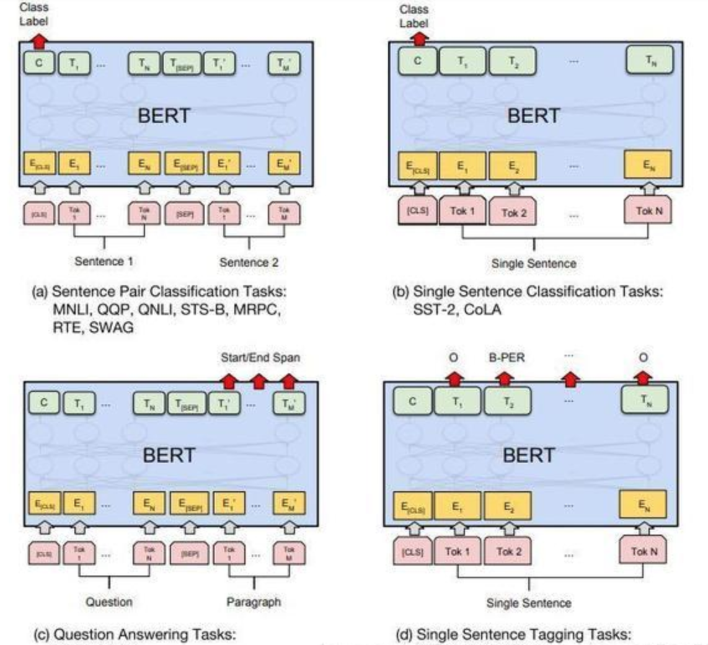

自然语言处理（NLP）讲义

## 一、NLP概述

### 1. NLP的定义

NLP（Nature Language Processing，自然语言处理）是计算机学科及人工智能领域一个重要的子学科，它主要研究计算机如何处理、理解及应用人类语言。所谓自然语言，指人说的话、人写的文章，是人类在长期进化过程中形成的一套复杂的符号系统（类似于C/Java等计算机语言则称为人造语言）。以下是关于自然语言处理常见的定义：

- 自然语言处理是计算机科学与语言中关于计算机与人类语言转换的领域。——中文维基百科
- 自然语言处理是人工智能领域中一个重要的方向。它研究实现人与计算机之间用自然语言进行有效沟通的各种理论和方法。——百度百科
- 自然语言处理研究在人与人交际中及人与计算机交际中的语言问题的一门学科。NLP要研制表示语言能力和语言应用的模型，建立计算机框架来实现这些语言模型，提出相应的方法来不断完善这种模型，并根据语言模型设计各种实用系统，以及对这些系统的评测技术。——Bill Manaris，《从人机交互的角度看自然语言处理》

自然语言处理还有其它一些名称，例如：自然语言理解（Natural Language Understanding），计算机语言学（Computational Linguistics），人类语言技术（Human Language Technology）等等。


### 2. NLP的主要任务

NLP的主要任务可以分为两大类，一类是基于现有文本或语料的分析，另一类是生成新的文本或语料。


#### 1）分词

该任务将文本或语料分隔成更小的语言单元（例如，单词）。对于拉丁语系，词语之间有空格分隔，对于中文、日文等语言，分词就是一项重要的基本任务，分词直接影响对文本语义的理解。例如：

```
文本：吉林市长春药店
分词1：吉林市/长春/药店
分词2：吉林/市长/春药/店
```

#### 2）词义消歧

词义消歧是识别单词正确含义的任务。例如，在句子“The dog <u>barked</u> at the mailman”（狗对邮递员吠叫）和“Tree <u>bark</u> is sometimes used as a medicine”（树皮有时用作药物）中，单词bark有两种不同的含义。词义消歧对于诸如问答之类的任务至关重要。

#### 3）命名实体识别（NER）

NER尝试从给定的文本主体或文本语料库中提取实体（例如，人物、位置和组织）。例如，句子：

```
John gave Mary two apples at school on Monday
```

将转换为：


#### 4）词性标记（PoS）

PoS标记是将单词分配到各自对应词性的任务。它既可以是名词、动词、形容词、副词、介词等基本词、也可以是专有名词、普通名词、短语动词、动词等。

#### 5）文本分类

文本分类有许多应用场景，例如垃圾邮件检测、新闻文章分类（例如，政治、科技和运动）和产品评论评级（即正向或负向）。我们可以用标记数据（即人工对评论标上正面或负面的标签）训练一个分类模型来实现这项任务。

#### 6）语言生成

可以利用NLP模型来生成新的文本或语料，例如机器写作（天气预报、新闻报道、模仿唐诗），生成文本摘要等。以下是一段机器合成的"诗"：

```
向塞唯何近，空令极是辞。向睹一我扇，猛绶临来惊。
向面炎交好，荷莎正若隳。即住长非乱，休分去此垂。
却定何人改，松仙绕绮霞。偶笑寒栖咽，长闻暖顶时。
失个亦垂谏，守身丈韦鸿。忆及他年事，应愁一故名。
坐忆山高道，为随夏郭间。到乱唯无己，千方得命赊。
```

#### 5）问答（QA）系统

QA技术具有很高的商业价值，这些技术是聊天机器人和VA（例如，Google Assistant和Apple Siri）的基础。许多公司已经采用聊天机器人来提供客户支持。以下是一段与聊天机器人的对话：


#### 6）机器翻译（MT）

机器翻译（Machine Translation，MT）指将文本由一种语言翻译成另一种语言，本质是根据一个序列，生成语义最相近的另一种语言序列。


### 3. NLP的发展历程

NLP的发展轨迹为：基于规则 → 基于统计 → 基于深度学习，其发展大致经历了4个阶段：1956年以前的萌芽期；1957~1970年的快速发展期；1971~1993年的低速发展期；1994年至今的复苏融合期。

#### 1）萌芽期（1956年以前）

- 1946年：第一台电子计算机诞生
- 1948年：Shannon把离散马尔可夫过程的概率模型应用于描述语言的自动机。接着，他又把热力学中“熵”(entropy)的概念引用于语言处理的概率算法中
- 1956年：Chomsky又提出了上下文无关语法，并把它运用到自然语言处理中

#### 2）快速发展期（1957~1970）

自然语言处理在这一时期很快融入了人工智能的研究领域中。由于有基于规则和基于概率这两种不同方法的存在，自然语言处理的研究在这一时期分为了两大阵营。一个是基于规则方法的符号派(symbolic)，另一个是采用概率方法的随机派(stochastic)。这一时期，两种方法的研究都取得了长足的发展。从50年代中期开始到60年代中期，以Chomsky为代表的符号派学者开始了形式语言理论和生成句法的研究，60年代末又进行了形式逻辑系统的研究。而随机派学者采用基于贝叶斯方法的统计学研究方法，在这一时期也取得了很大的进步。

这一时期的重要研究成果包括1959年宾夕法尼亚大学研制成功的TDAP系统，布朗美国英语语料库的建立等。1967年美国心理学家Neisser提出认知心理学的概念，直接把自然语言处理与人类的认知联系起来了。

#### 3）低速发展期（1971~1993）

随着研究的深入，由于人们看到基于自然语言处理的应用并不能在短时间内得到解决，而一连串的新问题又不断地涌现，于是，许多人对自然语言处理的研究丧失了信心。从70年代开始，自然语言处理的研究进入了低谷时期。
但尽管如此，一些研究人员依旧坚持继续着他们的研究。由于他们的出色工作，自然语言处理在这一低谷时期同样取得了一些成果。70年代，基于隐马尔可夫模型(Hidden Markov Model, HMM)的统计方法在语音识别领域获得成功。80年代初，话语分析(Discourse Analysis)也取得了重大进展。之后，由于自然语言处理研究者对于过去的研究进行了反思，有限状态模型和经验主义研究方法也开始复苏。

#### 4）复苏融合期（1994年至今）

90年代中期以后，有两件事从根本上促进了自然语言处理研究的复苏与发展。一件事是90年代中期以来，计算机的速度和存储量大幅增加，为自然语言处理改善了物质基础，使得语音和语言处理的商品化开发成为可能；另一件事是1994年Internet商业化和同期网络技术的发展使得基于自然语言的信息检索和信息抽取的需求变得更加突出。以下列举除了2000年之后NLP领域的几个里程碑事件：

- 2001年：神经语言模型

- 2008年：多任务学习

- 2013年： Word嵌入

- 2013年：NLP的神经网络

- 2014年：序列到序列模型

- 2015年：注意力机制

- 2015年：基于记忆的神经网络

- 2018年：预训练语言模型

  

### 4. NLP的困难与挑战

#### 1）语言歧义

**不同分词导致的歧义**

```
例如：自动化研究所取得的成就
理解一：自动化 / 研究 / 所 / 取得 / 的 / 成就
理解二：自动化 / 研究所 / 取得 / 的 / 成就
```

**词性歧义**

```
动物保护警察
```

“保护”理解成动词、名词，语义不一样

**结构歧义**

```
喜欢乡下的孩子
关于鲁迅的文章
```

**语音歧义**

```
节假日期间，所有博物馆全部（不）对外开放
```

#### 2）不同语言结构差异


#### 3）未知语言不可预测性

语言在不断演化，每年都有为数不少的新词语、新语料出现，给一些NLP处理任务造成困难。以下列举了几个2021年网络上出现的新词语：

```
双减
元宇宙
绝绝子
躺平
```

#### 4）语言表达的复杂性

```
甲：你这是什么意思？
乙：没什么意思，意思意思。
甲：你这就不够意思了。
乙：小意思，小意思。
甲：你这人真有意思。
乙：其实也没有别的意思。
甲：那我就不好意思了。
```

#### 5）机器处理语言缺乏背景与常识

```
中国国家队比赛最没悬念的是乒乓球和足球，他们一个谁也打不过，另一个谁也打不过
如果希拉里当选，她就是全世界唯一一个干过美国总统和干过美国总统的女人，克林顿也将成为全世界唯一一个干过美国总统和干过美国总统的男人
```


### 5. NLP相关知识构成


### 6. 语料库

#### 1）什么是语料库

语料库（corpus）是指存放语言材料的仓库。现代的语料库是指存放在计算机里的原始语料文本或经过加工后带有语言学信息标注的语料文本。以语言的真实材料为基础来呈现语言知识，反映语言单位的用法和意义，基本以知识的原型形态表现——语言的原貌。

#### 2）语料库的特征

- 语料库中存放的是实际中真实出现过的语言材料
- 语料库是以计算机为载体承载语言知识的基础资源，但不等于语言知识
- 真实语料需要经过分析、处理和加工，才能成为有用的资源

#### 3）语料库的作用

- 支持语言学研究和语言教学研究
- 支持NLP系统的开发

#### 4）常用语料库介绍

- 北京大学计算机语言所语料库标记（中文），地址：http://opendata.pku.edu.cn/dataverse/icl

- London-Lund英语口语语料库,地址：http://www.helsinki.fi/varieng/CoRD/copora.LLC/

- 腾讯中文语料库。包含800多万个中文词汇，其中每个词对应一个200维的向量，覆盖很多现代词汇，包括最近一两年出现的新词。采用了更大规模的数据和更好算法。https://ai.tencent.com/ailab/nlp/data/Tencent_AILab_ChineseEmbedding.tar.gz
- 中文维基百科语料库。维基百科是最常用且权威的开放网络数据集之一，作为极少数人工编辑、内容丰富、格式规范的文本语料，各类语言的维基百科在NLP中广泛应用。


## 二、传统NLP处理技术

### 1. 中文分词

中文分词是一项重要的基本任务，分词直接影响对文本语义的理解。分词主要有基于规则的分词、基于统计的分词和混合分词。基于规则的分词主要是通过维护词典，在切分语句时，将语句的每个子字符串与词表中的词语进行匹配，找到则切分，找不到则不切分；基于统计的分词，主要是基于统计规则和语言模型，输出一个概率最大的分词序列（由于所需的知识尚未讲解，此处暂不讨论）；混合分词就是各种分词方式混合使用，从而提高分词准确率。下面介绍基于规则的分词。

#### 1）正向最大匹配法

正向最大匹配法（Forward Maximum Matching，FMM）是按照从前到后的顺序对语句进行切分，其步骤为：

- 从左向右取待分汉语句的m个字作为匹配字段，m为词典中最长词的长度；
- 查找词典进行匹配；
- 若匹配成功，则将该字段作为一个词切分出去；
- 若匹配不成功，则将该字段最后一个字去掉，剩下的字作为新匹配字段，进行再次匹配；
- 重复上述过程，直到切分所有词为止。

#### 2）逆向最大匹配法

逆向最大匹配法（Reverse Maximum Matching， RMM）基本原理与FMM基本相同，不同的是分词的方向与FMM相反。RMM是从待分词句子的末端开始，也就是从右向左开始匹配扫描，每次取末端m个字作为匹配字段，匹配失败，则去掉匹配字段前面的一个字，继续匹配。

#### 3）双向最大匹配法

双向最大匹配法（Bi-directional Maximum Matching，Bi-MM）是将正向最大匹配法得到的分词结果和逆向最大匹配法得到的结果进行比较，然后按照最大匹配原则，选取词数切分最少的作为结果。双向最大匹配的规则是：

- 如果正反向分词结果词数不同，则取分词数量少的那个；

- 分词结果相同，没有歧义，返回任意一个；分词结果不同，返回其中单字数量较少的那个。


【示例1】正向最大匹配分词法

```python
# 正向最大匹配分词示例
class MM(object):
    def __init__(self):
        self.window_size = 3

    def cut(self, text):
        result = [] # 分词结果
        start = 0 # 起始位置
        text_len = len(text) # 文本长度

        dic = ["吉林", "吉林市", "市长", "长春", "春药", "药店"]

        while text_len > start:
            for size in range(self.window_size + start, start, -1): # 取最大长度，逐步比较减小
                piece = text[start:size] # 切片
                if piece in dic: # 在字典中
                    result.append(piece) # 添加到列表
                    start += len(piece)
                    break
                else: # 没在字典中，什么都不做
                    if len(piece) == 1:
                        result.append(piece) # 单个字成词
                        start += len(piece)

        return result

if __name__ == "__main__":
    text = "吉林市长春药店"
    tk = MM() # 实例化对象
    result = tk.cut(text)
    print(result)
```

执行结果：

```
['吉林市', '长春', '药店']
```


【示例2】逆向最大匹配分词法

```python
# 逆向最大匹配分词示例
class RMM(object):
    def __init__(self):
        self.window_size = 3

    def cut(self, text):
        result = [] # 分词结果
        start = len(text) # 起始位置
        text_len = len(text) # 文本长度

        dic = ["吉林", "吉林市", "市长", "长春", "春药", "药店"]

        while start > 0:
            for size in range(self.window_size, 0, -1):
                piece = text[start-size:start] # 切片
                if piece in dic: # 在字典中
                    result.append(piece) # 添加到列表
                    start -= len(piece)
                    break
                else: # 没在字典中
                    if len(piece) == 1:
                        result.append(piece) # 单个字成词
                        start -= len(piece)
                        break
        result.reverse()
        return result

if __name__ == "__main__":
    text = "吉林市长春药店"
    tk = RMM() # 实例化对象
    result = tk.cut(text)
    print(result)
```

执行结果：

```
['吉林市', '长春', '药店']
```


【示例3】Jieba库分词

Jieba是一款开源的、功能丰富、使用简单的中文分词工具库，它提供了三种分词模式：

- 精确模式：试图将句子最精确地分词，适合文本分析
- 全模式：把句子中所有可以成词的词语分割出来，速度快，但有重复词和歧义
- 搜索引擎模式：在精确模式基础上，对长词再次切分，提高召回率，适合用于搜索引擎分词

使用Jieba库之前，需要进行安装：

```
pip install jieba==0.42.1
```

分词示例代码如下：

```python
# jieba分词示例
import jieba

text = "吉林市长春药店"

# 全模式
seg_list = jieba.cut(text, cut_all=True)
for word in seg_list:
    print(word, end="/")
print()

# 精确模式
seg_list = jieba.cut(text, cut_all=False)
for word in seg_list:
    print(word, end="/")
print()

# 搜索引擎模式
seg_list = jieba.cut_for_search(text)
for word in seg_list:
    print(word, end="/")
print()
```

执行结果：

```
吉林/吉林市/市长/长春/春药/药店/
吉林市/长春/药店/
吉林/吉林市/长春/药店/
```


【示例4】文本高频词汇提取

```python
# 通过tf-idf提取高频词汇
import glob
import random
import jieba


# 读取文件内容
def get_content(path):
    with open(path, "r", encoding="gbk", errors="ignore") as f:
        content = ""
        for line in f.readlines():
            line = line.strip()
            content += line
        return content


# 统计词频，返回最高前10位词频列表
def get_tf(words, topk=10):
    tf_dict = {}

    for w in words:
        if w not in tf_dict.items():
            tf_dict[w] = tf_dict.get(w, 0) + 1  # 获取词频并加1

    # 倒序排列
    new_list = sorted(tf_dict.items(), key=lambda x: x[1], reverse=True)

    return new_list[:topk]


# 去除停用词
def get_stop_words(path):
    with open(path, encoding="utf8") as f:
        return [line.strip() for line in f.readlines()]


if __name__ == "__main__":
    # 样本文件
    fname = "d:\\NLP_DATA\\chap_3\\news\\C000008\\11.txt"
    # 读取文件内容
    corpus = get_content(fname)
    # 分词
    tmp_list = list(jieba.cut(corpus))
    # 去除停用词
    stop_words = get_stop_words("d:\\NLP_DATA\\chap_3\\stop_words.utf8")
    split_words = []
    for tmp in tmp_list:
        if tmp not in stop_words:
            split_words.append(tmp)

    # print("样本:\n", corpus)
    print("\n 分词结果: \n" + "/".join(split_words))

    # 统计高频词
    tf_list = get_tf(split_words)
    print("\n top10词 \n:", str(tf_list))
```

执行结果：

```
分词结果:
焦点/个股/苏宁/电器/002024/该股/早市/涨停/开盘/其后/获利盘/抛/压下/略有/回落/强大/买盘/推动/下该/股/已经/再次/封于/涨停/主力/资金/积极/拉升/意愿/相当/强烈/盘面/解析/技术/层面/早市/指数/小幅/探低/迅速/回升/中石化/强势/上扬/带动/指数/已经/成功/翻红/多头/实力/之强/令人/瞠目结舌/市场/高度/繁荣/情形/投资者/需谨慎/操作/必竟/持续/上攻/已经/消耗/大量/多头/动能/盘中/热点/来看/相比/周二/略有/退温/依然/看到/目前/热点/效应/外扩散/迹象/相当/明显/高度/活跌/板块/已经/前期/有色金属/金融/地产股/向外/扩大/军工/概念/航天航空/操作/思路/短线/依然/需/规避/一下/技术性/回调/风险/盘中/切记/不可/追高

top10词:
 [('已经', 4), ('早市', 2), ('涨停', 2), ('略有', 2), ('相当', 2), ('指数', 2), ('多头', 2), ('高度', 2), ('操作', 2), ('盘中', 2)]
```


### 2. 词性标注

#### 1）什么是词性标注

词性是词语的基本语法属性，通常也称为词类。词性标注是判定给定文本或语料中每个词语的词性。有很多词语在不同语境中表现为不同的词性，这就为词性标注带来很大的困难。另一方面，从整体上看，大多数词语，尤其是实词，一般只有一到两个词性，其中一个词性的使用频率远远大于另一个。

#### 2）词性标注的原理

词性标注最主要方法同分词一样，将其作为一个序列生成问题来处理。使用序列模型，根据输入的文本，生成一个对应的词性序列。

#### 3）词性标注规范

词性标注要有一定的标注规范，如将名词、形容词、动词表示为"n", "adj", "v"等。中文领域尚无统一的标注标准，较为主流的有北大词性标注集和宾州词性标注集。以下是北大词性标注集部分词性表示：


#### 4）Jieba库词性标注

Jieba库提供了词性标注功能，采用结合规则和统计的方式，具体为在词性标注的过程中，词典匹配和HMM共同作用。词性标注流程如下：

第一步：根据正则表达式判断文本是否为汉字；

第二步：如果判断为汉字，构建HMM模型计算最大概率，在词典中查找分出的词性，若在词典中未找到，则标记为"未知"；

第三步：若不如何上面的正则表达式，则继续通过正则表达式进行判断，分别赋予"未知"、”数词“或"英文"。

【示例】Jieba库实现词性标注

```python
import jieba.posseg as psg


def pos(text):
    results = psg.cut(text)
    for w, t in results:
        print("%s/%s" % (w, t), end=" ")
    print("")


text = "呼伦贝尔大草原"
pos(text)

text = "梅兰芳大剧院里星期六晚上有演出"
pos(text)
```

执行结果：

```
呼伦贝尔/nr 大/a 草原/n 
梅兰芳/nr 大/a 剧院/n 里/f 星期六/t 晚上/t 有/v 演出/v 
```


### 3. 命名实体识别（NER）

命名实体识别（Named Entities Recognition，NER）也是自然语言处理的一个基础任务，是信息抽取、信息检索、机器翻译、问答系统等多种自然语言处理技术必不可少的组成部分。其目的是识别语料中人名、地名、组织机构名等命名实体，实体类型包括3大类（实体类、时间类和数字类）和7小类（人名、地名、组织机构名、时间、日期、货币和百分比）。中文命名实体识别主要有以下难点：

（1）各类命名实体的数量众多。

（2）命名实体的构成规律复杂。

（3）嵌套情况复杂。

（4）长度不确定。

命名实体识别方法有：

（1）基于规则的命名实体识别。规则加词典是早期命名实体识别中最行之有效的方式。其依赖手工规则的系统，结合命名实体库，对每条规则进行权重赋值，然后通过实体与规则的相符情况来进行类型判断。这种方式可移植性差、更新维护困难等问题。

（2）基于统计的命名实体识别。基于统计的命名实体识别方法有：隐马尔可夫模型、最大熵模型、条件随机场等。其主要思想是基于人工标注的语料，将命名实体识别任务作为序列标注问题来解决。基于统计的方法对语料库的依赖比较大，而可以用来建设和评估命名实体识别系统的大规模通用语料库又比较少，这是该方法的一大制约。

（3）基于深度学习的方法。利用深度学习模型，预测词（或字）是否为命名实体，并预测出起始、结束位置。

（4）混合方法。将前面介绍的方法混合使用。

命名实体识别在深度学习部分有专门案例进行探讨和演示。


### 4. 关键词提取

关键词提取是提取出代表文章重要内容的一组词，对文本聚类、分类、自动摘要起到重要作用。此外，关键词提取还能使人们便捷地浏览和获取信息。现实中大量文本不包含关键词，自动提取关检测技术具有重要意义和价值。关键词提取包括有监督学习、无监督学习方法两类。

有监督关键词提取。该方法主要通过分类方式进行，通过构建一个较为丰富完整的词表，然后通过判断每个文档与词表中每个词的匹配程度，以类似打标签的方式，达到关键词提取的效果。该方法能获取较高的精度，但需要对大量样本进行标注，人工成本过高。另外，现在每天都有大量新的信息出现，固定词表很难将新信息内容表达出来，但人工实时维护词表成本过高。所以，有监督学习关键词提取方法有较明显的缺陷。

无监督关键词提取。相对于有监督关键词提取，无监督方法对数据要求低得多，既不需要人工维护词表，也不需要人工标注语料辅助训练。因此，在实际应用中更受青睐。这里主要介绍无监督关键词提取算法，包括TF-IDF算法，TextRank算法和主题模型算法。

#### 1）TF-IDF算法

TF-IDF（Term Frequency-Inverse Document Frequency，词频-逆文档频率）是一种基于传统的统计计算方法，常用于评估一个文档集中一个词对某份文档的重要程度。其基本思想是：一个词语在文档中出现的次数越多、出现的文档越少，语义贡献度越大（对文档区分能力越强）。TF-IDF表达式由两部分构成，词频、逆文档频率。词频定义为：
$$
TF_{ij} = \frac{n_{ji}}{\sum_k n_{kj}}
$$
其中，$n_{ij}$表示词语i在文档j中出现的次数，分母$\sum_k n_{kj}$表示所有文档总次数。逆文档频率定义为：
$$
IDF_i = log(\frac{|D|}{|D_i| + 1})
$$
其中，$|D|$为文档总数，$D_i$为文档中出现词i的文档数量，分母加1是避免分母为0的情况（称为拉普拉斯平滑），TF-IDF算法是将TF和IDF综合使用，表达式为：
$$
TF-IDF = TF_{ij} \times IDF_i =\frac{n_{ji}}{\sum_k n_{kj}} \times log(\frac{|D|}{|D_i| + 1})
$$
由公式可知，词频越大，该值越大；出现的文档数越多（说明该词越通用），逆文档频率越接近0，语义贡献度越低。例如有以下文本：

```
世界献血日，学校团体、献血服务志愿者等可到血液中心参观检验加工过程，我们会对检验结果进行公示，同时血液的价格也将进行公示。
```

以上文本词语总数为30，计算几个词的词频：
$$
TF_{献血} = 2 / 30 \approx 0.067 \\ 
TF_{血液} = 2 / 30 \approx 0.067 \\ 
TF_{进行} = 2 / 30 \approx 0.067 \\ 
TF_{公示} = 2 / 30 \approx 0.067
$$
假设总文档数量为1000，出现献血、血液、进行、公示文档数量分别为10、15、100、50，根据TF-IDF计算公式，得：
$$
TF-IDF_{献血} = 0.067 * log(1000/10) = 0.067 * 2 = 0.134\\ 
TF-IDF_{血液} = 0.067 * log(1000/15) = 0.067 * 1.824 = 0.1222 \\ 
TF-IDF_{进行} = 0.067 * log(1000/100) = 0.067 * 1 = 0.067 \\ 
TF-IDF_{公示} = 0.067 * log(1000/50) = 0.067 * 1.30 = 0.08717
$$
“献血”、“血液”的TF-IDF值最高，所以为最适合这篇文档的关键词。

#### 2）TextRank算法

与TF-IDF不一样，TextRank算法可以脱离于语料库，仅对单篇文档进行分析就可以提取该文档的关键词，这也是TextRank算法的一个重要特点。TextRank算法最早用于文档的自动摘要，基于句子维度的分析，利用算法对每个句子进行打分，挑选出分数最高的n个句子作为文档的关键句，以达到自动摘要的效果。

TextRank算法的基本思想来源于Google的PageRank算法，该算法是Google创始人拉里·佩奇和希尔盖·布林于1997年构建早期的搜索系统原型时提出的链接分析法，用于评价搜索系统各覆盖网页重要性的一种方法。随着Google的成功，该算法也称为其它搜索引擎和学术界十分关注的计算模型。


PageRank基本思想有两条：

- 链接数量。一个网页被越多的其它网页链接，说明这个网页越重要
- 链接质量。一个网页被一个越高权值的网页链接，也能表名这个网页越重要

基于上述思想，一个网页的PageRank计算公式可以表示为：
$$
S(V_i) = \sum_{j \in In(V_i)} \Bigg( \frac{1}{Out(V_j)} \times S(V_j) \Bigg)
$$
其中，$In(V_i)$为$V_i$的入链集合，$Out(V_j)$为$V_j$的出链集合，$|Out(V_j)|$为出链的数量。因为每个网页要将它自身的分数平均贡献给每个出链，则$\Bigg( \frac{1}{Out(V_j)} \times S(V_j) \Bigg)$即为$V_i$贡献给$V_j$的分数。将所有入链贡献给它的分数全部加起来，就是$V_i$自身的得分。算法开始时，将所有页面的得分均初始化为1。

对于一些孤立页面，可能链入、链出的页面数量为0，为了避免这种情况，对公式进行了改造，加入了一个阻尼系数$d$，这样，即使孤立页面也有一个得分。改造后的公式如下：
$$
S(V_i) = (1 - d) + d \times \sum_{j \in In(V_i)} \Bigg( \frac{1}{Out(V_j)} \times S(V_j) \Bigg)
$$
以上就是PageRank的理论，也是TextRank的理论基础，不同于的是TextRank不需要与文档中的所有词进行链接，而是采用一个窗口大小，在窗口中的词互相都有链接关系。例如对下面的文本进行窗口划分：

```
世界献血日，学校团体、献血服务志愿者等可到血液中心参观检验加工过程，我们会对检验结果进行公示，同时血液的价格也将进行公示。
```

如果将窗口大小设置为5，则可得到如下计算窗口：

```
[世界，献血，日，学校，团体]
[献血，日，学校，团体，献血]
[日，学校，团体，献血，服务]
[学校，团体，献血，服务，志愿者]
……
```

每个窗口内所有词之间都有链接关系，如[世界]和[献血，日，学校，团体]之间有链接关系。得到了链接关系，就可以套用TextRank公式，计算每个词的得分，最后选择得分最高的N个词作为文档的关键词。

#### 3）关键词提取示例

本案例演示了通过自定义TF-IDF、调用TextRank API实现关键字提取

```python
# -*- coding: utf-8 -*-

import math
import jieba
import jieba.posseg as psg
from gensim import corpora, models
from jieba import analyse
import functools
import numpy as np


# 停用词表加载方法
def get_stopword_list():
    # 停用词表存储路径，每一行为一个词，按行读取进行加载
    # 进行编码转换确保匹配准确率
    stop_word_path = '../data/stopword.txt'
    with open(stop_word_path, "r", encoding="utf-8") as f:
        lines = f.readlines()

    stopword_list = [sw.replace('\n', '') for sw in lines]
    return stopword_list


# 去除停用词
def word_filter(seg_list):
    filter_list = []
    for word in seg_list:
        # 过滤停用词表中的词，以及长度为<2的词
        if not word in stopword_list and len(word) > 1:
            filter_list.append(word)

    return filter_list


# 数据加载，pos为是否词性标注的参数，corpus_path为数据集路径
def load_data(corpus_path):
    # 调用上面方式对数据集进行处理，处理后的每条数据仅保留非干扰词
    doc_list = []
    for line in open(corpus_path, 'r', encoding='utf-8'):  # 循环读取一行(一行即一个文档)
        content = line.strip()  # 去空格
        seg_list = jieba.cut(content)  # 分词
        filter_list = word_filter(seg_list)  # 去除停用词
        doc_list.append(filter_list)  # 将分词后的内容添加到列表

    return doc_list


# idf值统计方法
def train_idf(doc_list):
    idf_dic = {}
    tt_count = len(doc_list)  # 总文档数

    # 每个词出现的文档数
    for doc in doc_list:
        doc_set = set(doc)  # 将词推入集合去重
        for word in doc_set:  # 词语在文档中
            idf_dic[word] = idf_dic.get(word, 0.0) + 1.0  # 文档数加1

    # 按公式转换为idf值，分母加1进行平滑处理
    for word, doc_cnt in idf_dic.items():
        idf_dic[word] = math.log(tt_count / (1.0 + doc_cnt))

    # 对于没有在字典中的词，默认其仅在一个文档出现，得到默认idf值
    default_idf = math.log(tt_count / (1.0))

    return idf_dic, default_idf


# TF-IDF类
class TfIdf(object):
    def __init__(self, idf_dic, default_idf, word_list, keyword_num):
        """
        TfIdf类构造方法
        :param idf_dic: 训练好的idf字典
        :param default_idf: 默认idf值
        :param word_list: 待提取文本
        :param keyword_num: 关键词数量
        """
        self.word_list = word_list
        self.idf_dic, self.default_idf = idf_dic, default_idf # 逆文档频率
        self.tf_dic = self.get_tf_dic()  # 词频
        self.keyword_num = keyword_num

    # 统计tf值
    def get_tf_dic(self):
        tf_dic = {}  # 词频字典
        for word in self.word_list:
            tf_dic[word] = tf_dic.get(word, 0.0) + 1.0

        total = len(self.word_list)  # 词语总数
        for word, word_cnt in tf_dic.items():
            tf_dic[word] = float(word_cnt) / total

        return tf_dic

    # 按公式计算tf-idf
    def get_tfidf(self):
        tfidf_dic = {}
        for word in self.word_list:
            idf = self.idf_dic.get(word, self.default_idf)
            tf = self.tf_dic.get(word, 0)

            tfidf = tf * idf  # 计算TF-IDF
            tfidf_dic[word] = tfidf

        # 根据tf-idf排序，去排名前keyword_num的词作为关键词
        s_list = sorted(tfidf_dic.items(), 
                        key=lambda x: x[1], 
                        reverse=True)
        # print(s_list)
        top_list = s_list[:self.keyword_num]  # 切出前N个
        for k, v in top_list:
            print(k + ", ", end='')
        print()


def tfidf_extract(word_list, keyword_num=20):
    doc_list = load_data('../data/corpus.txt')  # 读取文件内容
    # print(doc_list)
    idf_dic, default_idf = train_idf(doc_list) # 计算逆文档频率

    tfidf_model = TfIdf(idf_dic, default_idf, word_list, keyword_num)
    tfidf_model.get_tfidf()


def textrank_extract(text, keyword_num=20):
    keywords = analyse.textrank(text, keyword_num)
    # 输出抽取出的关键词
    for keyword in keywords:
        print(keyword + ", ", end='')
    print()


if __name__ == '__main__':
    global stopword_list

    text = """在中国共产党百年华诞的重要时刻，在“两个一百年”奋斗目标历史交汇关键节点，
    党的十九届六中全会的召开具有重大历史意义。全会审议通过的《决议》全面系统总结了党的百年奋斗
    重大成就和历史经验，特别是着重阐释了党的十八大以来党和国家事业取得的历史性成就、发生的历史性变革，
    充分彰显了中国共产党的历史自觉与历史自信。"""

    stopword_list = get_stopword_list()

    seg_list = jieba.cut(text)  # 分词
    filter_list = word_filter(seg_list)

    # TF-IDF提取关键词
    print('TF-IDF模型结果：')
    tfidf_extract(filter_list)

    # TextRank提取关键词
    print('TextRank模型结果：')
    textrank_extract(text)
```

执行结果：

```
TF-IDF模型结果：
历史, 中国共产党, 百年, 历史性, 华诞, 一百年, 奋斗目标, 交汇, 节点, 十九, 六中全会, 全会, 奋斗, 重大成就, 着重, 阐释, 十八, 党和国家, 成就, 变革, 

TextRank模型结果：
历史, 历史性, 意义, 成就, 决议, 审议, 发生, 系统, 总结, 全面, 节点, 关键, 交汇, 召开, 具有, 全会, 取得, 事业, 自信, 变革, 
```


### 6. 综合案例

#### 1）垃圾邮件分类

- 数据集介绍：包含5000份正常邮件、5001份垃圾邮件的样本
- 文本特征处理方式：采用TF-IDF作为文本特征值
- 模型选择：朴素贝叶斯、支持向量机模型
- 基本流程：读取数据 → 去除停用词和特殊符号 → 计算TF-IDF特征值 → 模型训练 → 预测 → 打印结果

```python
# -*- coding: utf-8 -*-
# 利用TF-IDF特征、朴素贝叶斯/支持向量机实现垃圾邮件分类
import numpy as np
import re
import string
import sklearn.model_selection as ms
from sklearn.naive_bayes import MultinomialNB
from sklearn.linear_model import SGDClassifier
from sklearn import metrics

import jieba
from sklearn.feature_extraction.text import TfidfVectorizer

label_name_map = ["垃圾邮件", "正常邮件"]


# 分词
def tokenize_text(text):
    tokens = jieba.cut(text)  # 分词
    tokens = [token.strip() for token in tokens]  # 去空格
    return tokens


def remove_special_characters(text):
    tokens = tokenize_text(text)
    # escape函数对字符进行转义处理
    # compile函数用于编译正则表达式，生成一个 Pattern 对象
    pattern = re.compile('[{}]'.format(re.escape(string.punctuation)))
    # filter() 函数用于过滤序列，过滤掉不符合条件的元素，返回由符合条件元素组成的新列表
    # sub函数进行正则匹配字符串替换
    filtered_tokens = filter(None, [pattern.sub('', token) for token in tokens])
    filtered_text = ' '.join(filtered_tokens)
    return filtered_text


# 去除停用词
def remove_stopwords(text):
    tokens = tokenize_text(text)  # 分词、去空格
    filtered_tokens = [token for token in tokens if token not in stopword_list]  # 去除停用词
    filtered_text = ''.join(filtered_tokens)
    return filtered_text


# 规范化处理
def normalize_corpus(corpus):
    result = []  # 处理结果

    for text in corpus:  # 遍历每个词汇
        text = remove_special_characters(text)  # 去除标点符号
        text = remove_stopwords(text)  # 去除停用词
        result.append(text)

    return result


def tfidf_extractor(corpus):
    vectorizer = TfidfVectorizer(min_df=1,
                                 norm='l2',
                                 smooth_idf=True,
                                 use_idf=True)
    features = vectorizer.fit_transform(corpus)
    return vectorizer, features


def get_data():
    '''
    获取数据
    :return: 文本数据，对应的labels
    '''
    corpus = []  # 邮件内容
    labels = []  # 标签(0-垃圾邮件 1-正常邮件)

    # 正常邮件
    with open("data/ham_data.txt", encoding="utf8") as f:
        for line in f.readlines():
            corpus.append(line)
            labels.append(1)

    # 垃圾邮件
    with open("data/spam_data.txt", encoding="utf8") as f:
        for line in f.readlines():
            corpus.append(line)
            labels.append(0)

    return corpus, labels


# 过滤空文档
def remove_empty_docs(corpus, labels):
    filtered_corpus = []
    filtered_labels = []

    for doc, label in zip(corpus, labels):
        if doc.strip():
            filtered_corpus.append(doc)
            filtered_labels.append(label)

    return filtered_corpus, filtered_labels


# 计算并打印分类指标
def print_metrics(true_labels, predicted_labels):
    # Accuracy
    accuracy = metrics.accuracy_score(true_labels, predicted_labels)

    # Precision
    precision = metrics.precision_score(true_labels,
                                        predicted_labels,
                                        average='weighted')

    # Recall
    recall = metrics.recall_score(true_labels,
                                  predicted_labels,
                                  average='weighted')

    # F1
    f1 = metrics.f1_score(true_labels,
                          predicted_labels,
                          average='weighted')

    print("正确率: %.2f, 查准率: %.2f, 召回率: %.2f, F1: %.2f" % (accuracy, precision, recall, f1))


if __name__ == "__main__":
    global stopword_list

    # 读取停用词
    with open("dict/stop_words.utf8", encoding="utf8") as f:
        stopword_list = f.readlines()

    corpus, labels = get_data()  # 加载数据
    corpus, labels = remove_empty_docs(corpus, labels)
    print("总的数据量:", len(labels))

    # 打印前N个样本
    for i in range(10):
        print("label:", labels[i], " 邮件内容:", corpus[i])

    # 对数据进行划分
    train_corpus, test_corpus, train_labels, test_labels = \
        ms.train_test_split(corpus,
                            labels,
                            test_size=0.10,
                            random_state=36)

    # 规范化处理
    norm_train_corpus = normalize_corpus(train_corpus)
    norm_test_corpus = normalize_corpus(test_corpus)

    # tfidf 特征
    ## 先计算tf-idf
    tfidf_vectorizer, tfidf_train_features = tfidf_extractor(norm_train_corpus)
    ## 再用刚刚训练的tf-idf模型计算测试集tf-idf
    tfidf_test_features = tfidf_vectorizer.transform(norm_test_corpus)
    # print(tfidf_test_features)
    # print(tfidf_test_features)

    # 基于tfidf的多项式朴素贝叶斯模型
    print("基于tfidf的贝叶斯模型")
    nb_model = MultinomialNB()  # 多分类朴素贝叶斯模型
    nb_model.fit(tfidf_train_features, train_labels)  # 训练
    mnb_pred = nb_model.predict(tfidf_test_features)  # 预测
    print_metrics(true_labels=test_labels, predicted_labels=mnb_pred)  # 打印测试集下的分类指标

    print("")

    # 基于tfidf的支持向量机模型
    print("基于tfidf的支持向量机模型")
    svm_model = SGDClassifier()
    svm_model.fit(tfidf_train_features, train_labels)  # 训练
    svm_pred = svm_model.predict(tfidf_test_features)  # 预测
    print_metrics(true_labels=test_labels, predicted_labels=svm_pred)  # 打印测试集下的分类指标

    print("")

    # 打印测试结果
    num = 0
    for text, label, pred_lbl in zip(test_corpus, test_labels, svm_pred):
        print('真实类别:', label_name_map[int(label)], ' 预测结果:', label_name_map[int(pred_lbl)])
        print('邮件内容【', text.replace("\n", ""), '】')
        print("")

        num += 1
        if num == 10:
            break
```

执行结果：

```
基于tfidf的贝叶斯模型
正确率: 0.97, 查准率: 0.97, 召回率: 0.97, F1: 0.97

基于tfidf的支持向量机模型
正确率: 0.98, 查准率: 0.98, 召回率: 0.98, F1: 0.98

真实类别: 正常邮件  预测结果: 正常邮件
邮件内容【 分专业吧，也分导师吧 标  题: Re: 问一个：有人觉得自己博士能混毕业吗 当然很好混毕业了 : 博士读到快中期了，始终感觉什么都不会，文章也没发几篇好的，论文的架构也没有， : 一切跟刚上的时候没有区别。但是事实上我也很辛苦的找资料，做实验，还进公司实习过， : 现在感觉好失败，内心已经放弃了，打算混毕业，不知道过来人有什么高招，请指点一二。 -- 】

真实类别: 垃圾邮件  预测结果: 垃圾邮件
邮件内容【 您好！ 我公司有多余的发票可以向外代开！（国税、地税、运输、广告、海关缴款书）。 如果贵公司（厂）有需要请来电洽谈、咨询！ 联系电话: 01351025****  陈先生 谢谢 顺祝商祺! 】

……
```


## 三、文本表示

### 1. One-hot

One-hot（独热）编码是一种最简单的文本表示方式。如果有一个大小为V的词表，对于第i个词$w_i$，可以用一个长度为V的向量来表示，其中第i个元素为1，其它为0.例如：

```python
减肥：[1, 0, 0, 0, 0]
瘦身：[0, 1, 0, 0, 0]
增重：[0, 0, 1, 0, 0]
```

One-hot词向量构建简单，但也存在明显的弱点：

- **维度过高**。如果词数量较多，每个词需要使用更长的向量表示，造成维度灾难；
- **稀疏矩阵**。每个词向量，其中只有一位为1，其它位均为零；
- **语义鸿沟**。词语之间的相似度、相关程度无法度量。

### 2. 词袋模型

词袋模型(Bag-of-words model，BOW)，BOW模型假定对于一个文档，忽略它的单词顺序和语法、句法等要素，将其仅仅看作是若干个词汇的集合，文档中每个单词的出现都是独立的，不依赖于其它单词是否出现。例如：

```
我把他揍了一顿，揍得鼻青眼肿
他把我走了一顿，揍得鼻青眼肿
```

构建一个词典：

```python
{"我":0, "把":1, "他":2, "揍":3, "了":4 "一顿":5, "鼻青眼肿":6, "得":7}
```

再将句子向量化，维数和字典大小一致，第i维上的数值代表ID为i的词在句子里出现的频次，两个句子可以表示为：

```python
[1, 1, 1, 2, 1, 1, 1, 1]
[1, 1, 1, 2, 1, 1, 1, 1]
```

词袋模型表示简单，但也存在较为明显的缺点：

- **丢失了顺序和语义**。顺序是极其重要的语义信息，词袋模型只统计词语出现的频率，忽略了词语的顺序。例如上述两个句子意思相反，但词袋模型表示却完全一致；
- **高维度和稀疏性**。当语料增加时，词袋模型维度也会增加，需要更长的向量来表示。但大多数词语不会出现在一个文本中，所以导致矩阵稀疏。

参考文章：https://blog.csdn.net/helinnlp/article/details/116358509

### 3. TF-IDF

TF-IDF（Term Frequency-Inverse Document Frequency，词频-逆文档频率）是一种基于传统的统计计算方法，常用于评估一个文档集中一个词对某份文档的重要程度。其基本思想是：一个词语在文档中出现的次数越多、出现的文档越少，语义贡献度越大（对文档区分能力越强）。其表达式为：
$$
TF-IDF = TF_{ij} \times IDF_i =\frac{n_{ji}}{\sum_k n_{kj}} \times log(\frac{|D|}{|D_i| + 1})
$$
该指标依然无法保留词语在文本中的位置关系。该指标前面有过详细讨论，此处不再赘述。

##### TF-IDF算法

TF-IDF（Term Frequency-Inverse Document Frequency，词频-逆文档频率）是一种基于传统的统计计算方法，常用于评估一个文档集中一个词对某份文档的重要程度。其基本思想是：一个词语在文档中出现的次数越多、出现的文档越少，语义贡献度越大（对文档区分能力越强）。TF-IDF表达式由两部分构成，词频、逆文档频率。词频定义为：
$$
TF_{ij} = \frac{n_{ji}}{\sum_k n_{kj}}
$$
其中，$n_{ij}$表示词语i在文档j中出现的次数，分母$\sum_k n_{kj}$表示所有文档总次数。逆文档频率定义为：
$$
IDF_i = log(\frac{|D|}{|D_i| + 1})
$$
其中，$|D|$为**文档总数**，$D_i$为文档中出现词i的文档数量，分母加1是避免分母为0的情况（称为拉普拉斯平滑），TF-IDF算法是将TF和IDF综合使用，表达式为：
$$
TF-IDF = TF_{ij} \times IDF_i =\frac{n_{ji}}{\sum_k n_{kj}} \times log(\frac{|D|}{|D_i| + 1})
$$
由公式可知，词频越大，该值越大；出现的文档数越多（说明该词越通用），逆文档频率越接近0，语义贡献度越低。例如有以下文本：

```
世界献血日，学校团体、献血服务志愿者等可到血液中心参观检验加工过程，我们会对检验结果进行公示，同时血液的价格也将进行公示。
```

以上文本词语总数为30，计算几个词的词频：
$$
TF_{献血} = 2 / 30 \approx 0.067 \\ 
TF_{血液} = 2 / 30 \approx 0.067 \\ 
TF_{进行} = 2 / 30 \approx 0.067 \\ 
TF_{公示} = 2 / 30 \approx 0.067
$$
假设总文档数量为1000，出现献血、血液、进行、公示文档数量分别为10、15、100、50，根据TF-IDF计算公式，得：
$$
TF-IDF_{献血} = 0.067 * log(1000/10) = 0.067 * 2 = 0.134\\ 
TF-IDF_{血液} = 0.067 * log(1000/15) = 0.067 * 1.824 = 0.1222 \\ 
TF-IDF_{进行} = 0.067 * log(1000/100) = 0.067 * 1 = 0.067 \\ 
TF-IDF_{公示} = 0.067 * log(1000/50) = 0.067 * 1.30 = 0.08717
$$
“献血”、“血液”的TF-IDF值最高，所以为最适合这篇文档的关键词。

### 4. 共现矩阵

共现（co-occurrence）矩阵指**通过统计一个事先指定大小的窗口内的词语共现次数，以词语周边的共现词的次数做为当前词语的向量**。具体来说，我们通过从大量的语料文本中构建一个共现矩阵来表示词语。例如，有语料如下：

```
I like deep learning.
I like NLP.
I enjoy flying.
```

则共现矩阵表示为：


矩阵定义的词向量在一定程度上缓解了one-hot向量相似度为0的问题，但没有解决数据稀疏性和维度灾难的问题。

### 5. N-Gram表示

N-Gram模型是一种基于统计语言模型，语言模型是一个基于概率的判别模型，它的输入是个句子（由词构成的顺序序列），输出是这句话的概率，即这些单词的联合概率。

N-Gram本身也指一个由N个单词组成的集合，各单词具有先后顺序，且不要求单词之间互不相同。常用的有Bi-gram（N=2）和Tri-gram（N=3）。例如：

句子：L love deep learning

Bi-gram: {I, love}, {love, deep}, {deep, learning}

Tri-gram: {I, love, deep}, {love deep learning}

N-Gram基本思想是将文本里面的内容按照字节进行大小为n的滑动窗口操作，形成了长度是n的字节片段序列。每一个字节片段称为一个gram，对所有gram的出现频度进行统计，并按照事先设置好的频度阈值进行过滤，形成关键gram列表，也就是这个文本向量的特征空间，列表中的每一种gram就是一个特征向量维度。

### 6. 词嵌入

#### 1）什么是词嵌入

词嵌入（word embedding）是一种词的向量化表示方式，该方法将词语映射为一个实数向量，同时保留词语之间语义的相似性和相关性。例如：

|        | Man  | Women | King  | Queen | Apple | Orange |
| ------ | ---- | ----- | ----- | ----- | ----- | ------ |
| Gender | -1   | 1     | -0.95 | 0.97  | 0.00  | 0.01   |
| Royal  | 0.01 | 0.02  | 0.93  | 0.95  | -0.01 | 0.00   |
| Age    | 0.03 | 0.02  | 0.70  | 0.69  | 0.03  | -0.02  |
| Food   | 0.09 | 0.01  | 0.02  | 0.01  | 0.95  | 0.97   |

我们用一个四维向量来表示man，Women，King，Queen，Apple，Orange等词语（在实际中使用更高维度的表示，例如100~300维），这些向量能进行语义的表示和计算。例如，用Man的向量减去Woman的向量值：
$$
e_{man} - e_{woman} = \left[
\begin{matrix}
-1 \\
0.01 \\
0.03 \\
0.09 \\
\end{matrix}
\right] -\left[
\begin{matrix}
1 \\
0.02 \\
0.02 \\
0.01 \\
\end{matrix}
\right] = \left[
\begin{matrix}
-2 \\
-0.01 \\
0.01 \\
0.08 \\
\end{matrix}
\right] \approx \left[
\begin{matrix}
-2 \\
0 \\
0 \\
0 \\
\end{matrix}
\right]
$$
类似地，如果用King的向量减去Queen的向量，得到相似的结果：
$$
e_{King} - e_{Queen} = \left[
\begin{matrix}
-0.95 \\
0.93 \\
0.70 \\
0.02 \\
\end{matrix}
\right] -\left[
\begin{matrix}
0.97 \\
0.85 \\
0.69 \\
0.01 \\
\end{matrix}
\right] = \left[
\begin{matrix}
-1.92 \\
-0.02 \\
0.01 \\
0.01 \\
\end{matrix}
\right] \approx \left[
\begin{matrix}
-2 \\
0 \\
0 \\
0 \\
\end{matrix}
\right]
$$
我们可以通过某种降维算法，将向量映射到低纬度空间中，相似的词语位置较近，不相似的词语位置较远，这样能帮助我们更直观理解词嵌入对语义的表示。如下图所示：


实际任务中，词汇量较大，表示维度较高，因此，我们不能手动为大型文本语料库开发词向量，而需要设计一种方法来使用一些机器学习算法（例如，神经网络）自动找到好的词嵌入，以便有效地执行这项繁重的任务。

#### 2）词嵌入的优点

- 特征稠密；
- 能够表征词与词之间的相似度；
- 泛化能力更好，支持语义计算。


## 四、语言模型

### 1. 什么是语言模型

语言模型在文本处理、信息检索、机器翻译、语音识别中承担这重要的任务。从通俗角度来说，语言模型就是通过给定的一个词语序列，预测下一个最可能的词语是什么。传统语言模型有N-gram模型、HMM（隐马尔可夫模型）等，进入深度学习时代后，著名的语言模型有神经网络语言模型（Neural Network Language Model，NNLM），循环神经网络（Recurrent Neural Networks，RNN）等。

语言模型从概率论专业角度来描述就是：为长度为m的字符串确定其概率分布$P(w_1, w_2, ..., w_n)$，其中$w_1$到$w_n$依次表示文本中的各个词语。一般采用链式法则计算其概率值：
$$
P(w_1, w_2, ..., w_n) = P(w_1)P(w_2|w_1)P(w_3|w_1,w_2)...P(w_m|w_1,w_2,...,w_{m-1})
$$
观察上式，可发现，当文本长度过长时计算量过大，所以有人提出N元模型（N-gram）降低计算复杂度。


### 2. N-gram模型

所谓N-gram（N元）模型，就是在计算概率时，忽略长度大于N的上下文词的影响。当N=1时，称为一元模型（Uni-gram Mode），其表达式为：
$$
P(w_1, w_2, ..., w_n) = \prod_{i=1}^m P(w_i)
$$
当N=2时，称为二元模型（Bi-gram Model），其表达式为：
$$
P(w_1, w_2, ..., w_n) = \prod_{i=1}^m P(w_i|w_{i-1})
$$
当N=3时，称为三元模型（Tri-gram Model），其表达式为：
$$
P(w_1, w_2, ..., w_n) = \prod_{i=1}^m P(w_i|w_{i-2}, w_{i-1})
$$
可见，N值越大，保留的词序信息（上下文）越丰富，但计算量也呈指数级增长。


### 3. 神经网络语言模型（NNLM）

 NNLM是利用神经网络对N元条件进行概率估计的一种方法，其基本结构如下图所示：


- 输入：前N-1个词语的向量

- 输出：第N个词语的一组概率

- 目标函数：

$$
f(w_t, t_{t-1}, ..., w_{t-n+1}) = p(p_t|w_1^{t-1})
$$

其中，$w_t$表示第t个词，$w_1^{t-1}$表示第1个到第t个词语组成的子序列，每个词语概率均大于0，所有词语概率之和等于1。该模型计算包括两部分：特征映射、计算条件概率

- 特征映射：将输入映射为一个特征向量，映射矩阵$C \in R^{|V| \times m}$

- 计算条件概率分布：通过另一个函数，将特征向量转化为一个概率分布

神经网络计算公式为：
$$
h = tanh(Hx + b) \\
y = Uh + d
$$
H为隐藏层权重矩阵，U为隐藏层到输出层的权重矩阵。输出层加入softmax函数，将y转换为对应的概率。模型参数$\theta$，包括：
$$
\theta = (b, d, H, U, C)
$$
以下是一个计算示例：设词典大小为1000，向量维度为25，词语个数N=3，先将前N个词表示成独热向量：

```python
呼：[1,0,0,0,0,...,0]
伦：[0,1,0,0,0,...,0]
贝：[0,0,1,0,0,...,0]
```

输入矩阵为：[3, 1000]

权重矩阵：[1000, 25]

隐藏层：[3, 1000] * [1000, 25] = [3, 25]  (结果为词向量，表示3个词，每个是25维向量)

输出层权重：[25, 1000]

输出矩阵：[3, 25] * [25, 1000] = [3, 1000] ==> [1, 1000]，表示预测属于1000个词的概率.


### 4. Word2vec

Word2vec是Goolge发布的、应用最广泛的词嵌入表示学习技术，其主要作用是高效获取词语的词向量，目前被用作许多NLP任务的特征工程。Word2vec 可以根据给定的语料库，通过优化后的训练模型快速有效地将一个词语表达成向量形式，为自然语言处理领域的应用研究提供了新的工具，包含Skip-gram（跳字模型）和CBOW（连续词袋模型）来建立词语的词嵌入表示。Skip-gram的主要作用是根据当前词，预测背景词（前后的词）；CBOW的主要作用是根据背景词（前后的词）预测当前词。

#### 1）Skip-gram

Skip-gram的主要作用是根据当前词，预测背景词（前后的词），其结构图如下图所示：


例如有如下语句：呼伦贝尔大草原

```
呼_ _ 尔_ _原
_伦_ _大_ _
_ _贝_ _ 草_
呼_ _尔_ _原
_伦_ _大_ _
```

预测出前后词的数量，称为window_size（以上示例中windows_size为2），实际是要将以下概率最大化：

```
P(伦|呼)P(贝|呼)
P(伦|尔)P(贝|尔) P(大|尔)P(草|尔)
P(大|原)P(草|原)
......
```

可以写出概率的一般化表达式，设有文本Text，由N个单词组成：
$$
Text = {w_1, w_2, w_3, ..., w_n}
$$
目标函数可以写作：
$$
argmax \prod_{w \in Text} \prod_{c \in c(w)} P(c|w; \theta)
$$
因为概率均为0~1之间的数字，连乘计算较为困难，所以转换为对数相加形式：
$$
argmax \sum_{w \in Text} \sum_{c \in c(w)} logP(c|w;\theta)
$$
再表示为softmax形式：
$$
argmax \sum_{w \in Text} \sum_{c \in c(w)} log \frac{e^{u_c \cdot v_w}}{\sum_{c' \in vocab }e_{c'} \cdot v_w}
$$
其中，U为上下文单词矩阵，V为同样大小的中心词矩阵，因为每个词可以作为上下文词，同时也可以作为中心词，再将如上公式进一步转化：
$$
argmax \sum_{c \in Text} \sum_{c \in c(w)} u_c \cdot v_w - log \sum_{c' \in vocab }e_{c'} \cdot v_w
$$
上式中，由于需要在整个词汇表中进行遍历，如果词汇表很大，计算效率会很低。所以，真正进行优化时，采用另一种优化形式。例如有如下语料库：

```
文本：呼伦贝尔大草原
```

将window_size设置为1，构建正案例词典、负案例词典（一般来说，负样本词典比正样本词典大的多）：

```python
正样本：D = {(呼，伦)，(伦，呼)，(伦，贝)，(贝，伦),(贝，尔),(尔，贝)，(尔，大)，(大，尔)，(大，草)(草，大)，(草，原)，(原，草)}

负样本：D’= {(呼，贝),(呼，尔),(呼，大)，(呼，草)，(呼，原)，(伦，尔),(伦，大),(伦，草),(伦，原),(贝，呼),(贝，大),(贝，草),(贝，原),(尔，呼),(尔，伦)(尔，草),(尔，原),(大，呼),(大，伦),(大，原)，(草，呼)，(草，伦)，(草，贝)，(原，呼)，(原，伦)，(原，贝)，(原，尔)，(原，大)}
```

词向量优化的目标函数定义为正样本、负样本公共概率最大化函数：
$$
argmax (\prod_{w,c \in D} log P(D=1|w,c; \theta) \prod_{w, c \in D'} P(D=0|w, c; \theta))  \\
= argmax (\prod_{w,c \in D} \frac{1}{1+exp(-U_c \cdot V_w)} \prod_{w, c \in D'} [1- \frac{1}{1+exp(-U_c \cdot V_w)}])  \\
= argmax(\sum_{w,c \in D} log \sigma (U_c \cdot V_w) + \sum_{w,c \in D'} log \sigma (-U_c \cdot V_w))
$$
在实际训练时，会从负样本集合中选取部分样本（称之为“负采样”）来进行计算，从而降低运算量.要训练词向量，还需要借助于语言模型.

#### 2）CBOW模型

CBOW模型全程为Continous Bag of Words（连续词袋模型），其核心思想是用上下文来预测中心词，例如：

```
呼伦贝_大草原
```

其模型结构示意图如下：


- 输入：$C \times V$的矩阵，C表示上下文词语的个数，V表示词表大小
- 隐藏层：$V \times N$的权重矩阵，一般称为word-embedding，N表示每个词的向量长度，和输入矩阵相乘得到$C \times N$的矩阵。综合考虑上下文中所有词信息预测中心词，所以将$C \times N$矩阵叠加，得到$1 \times N$的向量
- 输出层：包含一个$N \times V$的权重矩阵，隐藏层向量和该矩阵相乘，输出$1 \times V$的向量，经过softmax转换为概率，对应每个词表中词语的概率

#### 3）示例：训练词向量

数据集：来自中文wiki文章

代码：建议在AIStudio下执行

- 安装gensim

```shell
!pip install gensim==3.8.1 # 如果不在AIStudio下执行去掉前面的叹号
```

- 用于解析XML，读取XML文件中的数据，并写入到新的文本文件中

```python
import logging
import os.path
import os
from gensim.corpora import WikiCorpus


# 1. 获取输入数据路径
inp = 'data/data104767/articles.xml.bz2'

# 2. 创建新的文本文件（输出文件）
outp = open('wiki.zh.text','w',encoding='utf-8')

# 3. 调用gensim读取xml压缩文件
count = 0
wiki = WikiCorpus(inp, lemmatize=False, dictionary={})
for text in wiki.get_texts():
     outp.write( " ".join(text) + "\n")
     count += 1
     if count % 200 == 0:
        print("count:", count)
     if count % 20000 == 0:
         break
outp.close()
print("Finished Saved " +str(count) + " articles")
```

- 生成分词文件

```python
import jieba
import jieba.analyse
import codecs # python封装的文件的工具包


def process_wiki_text(origin_file,target_file):
    with codecs.open(origin_file, 'r','utf-8') as inp, codecs.open(target_file,'w','utf-8') as outp:
        line = inp.readline()
        num = 1
        while line:
            line_seg = " ".join(jieba.cut(line))
            outp.writelines(line_seg)
            num += 1
            line = inp.readline()
        print('----', num, ' articles----')
    inp.close()
    outp.close()

process_wiki_text('wiki.zh.text','wiki.zh.text.seg')
```

- 训练

```python
# 导入工具库
import logging
import sys
import multiprocessing # cpu开启多线程执行
from gensim.models import Word2Vec
# 按照行的方式读取文件内容（分词文件）
from gensim.models.word2vec import LineSentence 

logger = logging.getLogger(__name__)
# format: 指定输出的格式和内容，format可以输出很多有用信息，
# %(asctime)s: 打印日志的时间
# %(levelname)s: 打印日志级别名称
# %(message)s: 打印日志信息
logging.basicConfig(format='%(asctime)s: %(levelname)s: %(message)s')
logging.root.setLevel(level=logging.INFO)

# 1.输入文件
inp = 'wiki.zh.text.seg'

# 2.输出文件
outp1 = 'wiki.zh.text.model'   # 模型
outp2 = 'wiki.zh.text.vector'  # 权重

# 3.模型的训练和保存
model = Word2Vec(
    LineSentence(inp),
    size=100, # 词向量的维度（25~1000）
    window=3,
    min_count=5, # 如果语料库中单词出现的次数小于5，就忽略该单词
    workers=multiprocessing.cpu_count()
)
model.save(outp1)
model.wv.save_word2vec_format(outp2,binary=False)
```

- 测试

```python
import gensim
from gensim.models import  Word2Vec

# 1. 加载模型
model = Word2Vec.load('whik.zh.text.model')
count = 0

# 2. 变量单词和对应的向量
count = 0
for word in model.wv.index2word:
    print(word, model[word])
    count += 1
    if count==10:
        break

print("==============================================")

result = model.most_similar(u"铁路")
for r in result:
    print(r)

print("==============================================")

result2 = model.most_similar(u"中药")
for r in result2:
    print(r)
```

输出（训练过程略）：

```
('高速铁路', 0.8310302495956421)
('客运专线', 0.8245105743408203)
('高铁', 0.8095601201057434)
('城际', 0.802475094795227)
('联络线', 0.7837506532669067)
('成昆铁路', 0.7820425033569336)
('支线', 0.7775323390960693)
('通车', 0.7751388549804688)
('沪', 0.7748854756355286)
('京广', 0.7708789110183716)
==============================================
('草药', 0.9046826362609863)
('中药材', 0.8511005640029907)
('气功', 0.8384993672370911)
('中医学', 0.8368280529975891)
('调味', 0.8364394307136536)
('冶炼', 0.8328938484191895)
('药材', 0.8304706811904907)
('有机合成', 0.8298543691635132)
('针灸', 0.8297436833381653)
('药用', 0.8281913995742798)
```


### 5. 循环神经网络（RNN）

前面提到的关于NLP的模型及应用，都未考虑词的顺序问题，而在自然语言中，词语顺序又是极其重要的特征。循环神经网络（Recurrent Neural Network，RNN）能够在原有神经网络的基础上增加记忆单元，处理任意长度的序列（理论上），并且在前后词语（或字）之间建立起依赖关系。相比于CNN，RNN更适合处理视频、语音、文本等与时序相关的问题。

#### 1）原生RNN

##### ① RNN起源及发展

1982年，物理学家约翰·霍普菲尔德（John Hopfield）利用电阻、电容和运算放大器等元件组成的模拟电路实现了对网络神经元的描述，该网络从输出到输入有反馈连接。1986年，迈克尔·乔丹（Michael Jordan，不是打篮球那哥们，而是著名人工智能学者、美国科学院院士、吴恩达的导师）借鉴了Hopfield网络的思想，正式将循环连接拓扑结构引入神经网络。1990年，杰弗里·埃尔曼（Jeffrey Elman）又在Jordan的研究基础上做了部分简化，正式提出了RNN模型（那时还叫Simple Recurrent Network，SRN）。

##### ② RNN的结构

RNN结构如下图所示：


上图中，左侧为不展开的画法，右侧为展开画法。内部结构如下图所示：


计算公式可表示为：
$$
s_t = f(U \cdot x_t + W \cdot s_{t-1} + b) \\ 
y_t = g(V \cdot s_t + d)
$$
其中，$x_t$表示$t$时刻的输入；$s_t$表示$t$时刻隐藏状态；$f$和$g$表示激活函数；$U，V，W$分别表示输入层 → 隐藏层权重、隐藏层 → 输出层权重、隐藏层 → 隐藏层权重。对于任意时刻$t$，所有权重和偏置都共享，这极大减少了模型参数量。

计算时，首先利用前向传播算法，依次按照时间顺序进行计算，再利用反向传播算法进行误差传递，和普通BP（Back Propagation）网络唯一区别是，加入了时间顺序，计算方式有些微差别，称为BPTT（Back Propagation Through Time）算法。

##### ③ RNN的功能

RNN善于处理跟序列相关的信息，如：语音识别，语言建模，翻译，图像字幕。它能根据近期的一些信息来执行/判别/预测当前任务。例如：

```
白色的云朵漂浮在蓝色的____
天空中飞过来一只___
```

根据前面输入的一连串词语，可以预测第一个句子最后一个词为"天空"、第二个句子最后一个词为"鸟"的概率最高。

##### ④ RNN的缺陷

因为计算的缘故，RNN容易出现梯度消失，导致它无法学习过往久远的信息，无法处理长序列、远期依赖任务。例如：

```
我生长在中国，祖上十代都是农民，家里三亩一分地。我是家里老三，我大哥叫大狗子，二哥叫二狗子，我叫三狗子，我弟弟叫狗窝子。我的母语是_____
```

要预测出句子最后的词语，需要根据句子开够的信息"我出生在中国"，才能确定母语是"中文"或"汉语"的概率最高。原生RNN在处理这类远期依赖任务时出现了困难，于是LSTM被提出。

#### 2）LSTM

长短期记忆模型（Long Short Term Memory，LSTM）是RNN的变种，于1997年Schmidhuber和他的合作者Hochreiter提出，由于独特的设计结构，LSTM可以很好地解决梯度消失问题，能够处理更长的序列，更好解决远期依赖任务。LSTM非常适合构造大型深度神经网络。2009年，用改进版的LSTM，赢得了国际文档分析与识别大赛（ICDAR）手写识别大赛冠军；2014年，Yoshua Bengio的团队提出了一种更好的LSTM变体GRU（Gated Recurrent Unit，门控环单元）；2016年，Google利用LSTM来做语音识别和文字翻译；同年，苹果公司使用LSTM来优化Siri应用。

LSTM同样具有链式结构，它具有4个以特殊方式互相影响的神经网络层。其结构入下图所示：


LSTM的核心是细胞状态，用贯穿细胞的水平线表示。细胞状态像传送带一样。它贯穿整个细胞却只有很少的分支，这样能保证信息不变的流过整个结构。同时，LSTM通过称为门（gate）的结构来对单元状态进行增加或删除，包含三扇门：

- **遗忘门**：决定哪些信息丢弃

  

  表达式为：$f_t = \sigma (W_f \cdot [h_{t-1}, x_t] + b_f)$，当输出为1时表示完全保留，输出为0是表示完全丢弃

- **输入门**：决定哪些信息输入进来

  

  表达式为：
  $$
  i_t = \sigma (W_i \cdot [h_{t-1}, x_t] + b_i) \\ 
  \tilde{C}_t = tanh(W_c \cdot [h_{t-1}, x_t] + b_c)
  $$

  根据输入、遗忘门作用结果，可以对细胞状态进行更新，如下图所示：

  

  状态更新表达式为：
  $$
  C_t = f_t \cdot C_{t-1} + i_t \cdot \tilde{C}_t
  $$
  遗忘门找到了需要忘掉的信息$f_t$后，再将它与旧状态相乘，丢弃掉确定需要丢弃的信息。再将结果加上$i_t \cdot C_t$使细胞状态获得新的信息，这样就完成了细胞状态的更新。

- **输出门**：决定输出哪些信息

  

输出门表达式为：
$$
O_t = \sigma (W_o \cdot [h_{t-1}, x_t] + b_o) \\ 
h_t = O_t \cdot tanh(C_t)
$$
在输出门中，通过一个Sigmoid层来确定哪部分的信息将输出，接着把细胞状态通过Tanh进行处理（得到一个在-1～1之间的值）并将它和Sigmoid门的输出相乘，得出最终想要输出的那部分。

#### 3）GRU


没有Wf了，GRU参数少了，减少过拟合了。

RNN，LSTM,GRU渐渐地已经淡出我们的历史舞台了，因为运算太慢了，数据量大的话特别慢

现在更多的是CNN和transformer等，可以并行计算。

#### 4）双向循环神经网络

双向循环神经网络（BRNN）由两个循环神经网络组成，一个正向、一个反向，两个序列连接同一个输出层。正向RNN提取正向序列特征，反向RNN提取反向序列特征。例如有如下两个语句：

```
我喜欢苹果，比安卓用起来更流畅些
我喜欢苹果，基本上每天都要吃一个
```

根据后面的描述，我们可以得知，第一句中的"苹果"指的是苹果手机，第二句中的"苹果"指的是水果。双向循环神经网络结构如下图所示：


权重设置如下图所示：


计算表达式为：
$$
h_t = f(w_1x_t + w_2h_{t-1}) \\ 
h_t' = f(w_3x_t + w_5h'_{t+1}) \\ 
o_t = g(w_4h_t + w_6h'_t)
$$
其中，$h_t$为$t$时刻正向序列计算结果，$h'_t$为$t$时刻反向序列的计算结果，将正向序列、反向序列结果和各自权重矩阵相乘，相加后结果激活函数产生$t$时刻的输出。

通常情况下，双向循环神经网络能获得比单向网络更好的性能。

### 6、transformer

网络结构：transformer是个Encoder和Decoder的结构。


##### Encoder模块

- Encoder模块的结构和作用:
  - 经典的Transformer结构中的Encoder模块包含6个Encoder Block.
  - 每个Encoder Block包含一个多头自注意力层, 和一个前馈全连接层.
- 关于Encoder Block:
  - 在Transformer架构中, 6个一模一样的Encoder Block层层堆叠在一起, 共同组成完整的Encoder, 因此剖析一个Block就可以对整个Encoder的内部结构有清晰的认识.

##### 1、多头自注意力层(self-attention):

> - 首先来看self-attention的计算规则图:
> - 
>
> 


------

> - 上述attention可以被描述为将query和key-value键值对的一组集合映射到输出, 输出被计算为values的加权和, 其中分配给每个value的权重由query与对应key的相似性函数计算得来. 这种attention的形式被称为**Scaled Dot-Product Attention**(缩放点积注意力机制)， 对应的数学公式形式如下:
> - 其实呢，这个Q=Embeddings x Wq得到，同理，K=Embeddings x Wk; V=Embeddings x Wv得到。


------

> - 所谓的**多头self-attention**层, 则是先将Q, K, V经过参数矩阵进行映射, 再做self-attention, 最后将结果拼接起来送入一个全连接层即可.


------

> - 上述的多头self-attention, 对应的数学公式形式如下:


------

> - 多头self-attention层的作用: 实验结果表明, **Multi-head可以在更细致的层面上提取不同head的特征**(跟不同的卷积核提取图像特征作用类似), 总体计算量和单一head相同的情况下, 提取特征的效果更佳.

------

##### 2、前馈全连接层模块

- 前馈全连接层模块, 由两个线性变换组成, 中间有一个Relu激活函数, 对应的数学公式形式如下:


------

> - 注意: 原版论文中的前馈全连接层, 输入和输出的维度均为d_model = 512, 层内的连接维度d_ff = 2048, 均采用4倍的大小关系.

------

> - 前馈全连接层的作用: **单纯的多头注意力机制并不足以提取到理想的特征, 因此增加全连接层来提升网络的能力.**

##### **Decoder模块**

- Decoder模块的结构和作用:
  - 经典的Transformer结构中的Decoder模块包含6个Decoder Block.
  - 每个Decoder Block包含三个子层.
    - 一个多头self-attention层
    - 一个Encoder-Decoder attention层
    - 一个前馈全连接层

------

##### 1、Decoder Block中的多头self-attention层

- Decoder中的多头self-attention层与Encoder模块一致, 但需要注意的是Decoder模块的多头self-attention需要做**look-ahead-mask**, 因为在预测的时候"不能看见未来的信息", 所以要将当前的token和之后的token全部mask.

------

##### 2、Decoder Block中的Encoder-Decoder attention层

- 这一层区别于自注意力机制的Q = K = V, 此处矩阵Q来源于Decoder端经过上一个Decoder Block的输出, 而矩阵K, V则来源于Encoder端的输出, 造成了Q != K = V的情况.
- 这样设计是为了让Decoder端的token能够给予Encoder端对应的token更多的关注.
- 通过计算Q和K的相似度(余弦向量的内积，内积越大相似度越大，相反则越小)来算V的权重，每一个V相加的时候就会根据权重值来进行相加。其中，Q,K,V长度都是一样的
- 

------

##### 3、Decoder Block中的前馈全连接层

- 此处的前馈全连接层和Encoder模块中的完全一样.

------

- Decoder Block中有2个注意力层的作用: **多头self-attention层是为了拟合Decoder端自身的信息, 而Encoder-Decoder attention层是为了整合Encoder和Decoder的信息.**
- 多头self-attention层也是为了模拟卷积层输出多通道的这样一个过程。
- 自回归的概念：当前时刻的单词表示必须得有前面时刻的单词表示，一个一个来预测下一个单词。

------

**Add & Norm模块**

- Add & Norm模块接在每一个Encoder Block和Decoder Block中的每一个子层的后面. 具体来说Add表示残差连接, Norm表示LayerNorm.
  - 对于每一个Encoder Block, 里面的两个子层后面都有Add & Norm.
  - 对于每一个Decoder Block, 里面的三个子层后面都有Add & Norm.
  - 具体的数学表达形式为: LayerNorm(x + Sublayer(x)), 其中Sublayer(x)为子层的输出.

------

- Add残差连接的作用: 和其他神经网络模型中的残差连接作用一致, **都是为了将信息传递的更深, 增强模型的拟合能力**. 试验表明残差连接的确增强了模型的表现.

------

- Norm的作用: 随着网络层数的增加, 通过多层的计算后参数可能会出现过大, 过小, 方差变大等现象, 这会导致学习过程出现异常, 模型的收敛非常慢. 因此对每一层计算后的数值进行规范化可以提升模型的表现.

- Layer Norm 和 batch normal是有区别的：Layer Norm是把每一个batch的每一个行进行norm，batch normal是将每一个列(也就是每一个feature)做norm操作。蓝色表示batch normal，黄色表示layer norm。

  

------

**位置编码器Positional Encoding**

- Transformer中直接采用正弦函数和余弦函数来编码位置信息, 如下图所示:


------

- 需要注意: 三角函数应用在此处的一个重要的优点, 因为对于任意的PE(pos+k), 都可以表示为PE(pos)的线性函数, 大大方便计算. 而且周期性函数不受序列长度的限制, 也可以增强模型的泛化能力.
- 

式中，p为序列中的位置索引值；0≤i＜d是位置编码向量中的索引值。
无论是使用位置嵌入还是位置编码，在获得一个位置对应的向量后，再与该位置对应的词向量进行相加，即可表示该位置的输入向量。这样即使词向量相同，但是如果它们所处的位置不同，其最终的向量表示也不相同，从而解决了原始自注意力模型无法对序列进行建模的问题。

Decoder会做mask-Encoder-Decoder操作的原因是为了避免在t时刻看到t时刻以后的东西。具体操作就是将Qt时刻之后的值给它赋值成很大的一个负数。这样在后面做sofmax的时候指数结果就是0了。


输入--->多头注意力机制抽取序列信息，信息汇聚--->MLP进行空间维度映射成我想要的维度和大小。

- 为什么要加Position-Encoding层，就是attention是没有时序信息的，像RNN系列都是有时序信息的。

##### 十万个为什么？

- Q1：

### 7、BERT

架构代码理解：https://blog.csdn.net/weixin_43178406/article/details/111916010


bert分类任务：embeddings+transformer+fc+softmax

##### 1.5.1、BERT的架构

- 总体架构: 如下图所示, 最左边的就是BERT的架构图, 可以很清楚的看到BERT采用了Transformer Encoder block进行连接, 因为是一个典型的双向编码模型.


------

- 从上面的架构图中可以看到, 宏观上BERT分三个主要模块.
  - 最底层黄色标记的Embedding模块.
  - 中间层蓝色标记的Transformer模块.
  - 最上层绿色标记的预微调模块.

------

##### 1.5.2、Embedding模块:

BERT中的该模块是由三种Embedding共同组成而成, 如下图


------

> - **`Token Embeddings`** 是**词嵌入张量**, 第一个单词是CLS标志, 可以用于之后的分类任务.
> - **`Segment Embeddings`** 是**句子分段嵌入张量**, 是为了服务后续的两个句子为输入的预训练任务.
> - **`Position Embeddings`** 是**位置编码张量**, 此处注意和传统的Transformer不同, 不是三角函数计算的固定位置编码, 而是**通过学习得出来**的.
> - 整个Embedding模块的输出张量就是这3个张量的直接加和结果.

------

##### 1.5.3、双向Transformer模块

 BERT中只使用了经典Transformer架构中的Encoder部分, 完全舍弃了Decoder部分. 而两大预训练任务也集中体现在训练Transformer模块中.

------

##### 1.5.4、预微调模块

- 经过中间层Transformer的处理后, BERT的最后一层根据任务的不同需求而做不同的调整即可.
- 比如对于sequence-level的**`分类任务, BERT直接取第一个[CLS] token 的final hidden state, 再加一层全连接层后进行softmax来预测最终的标签.`**

------

> - 对于不同的任务, 微调都集中在预微调模块, 几种重要的NLP微调任务架构图展示如下



------

> - 从上图中可以发现, 在面对特定任务时, 只需要对预微调层进行微调, 就可以利用Transformer强大的注意力机制来模拟很多下游任务, 并得到SOTA的结果. (句子对关系判断, 单文本主题分类, 问答任务(QA), 单句贴标签(NER))

------

> - 若干可选的超参数建议如下:

```
Batch size: 16, 32
Learning rate (Adam): 5e-5, 3e-5, 2e-5
Epochs: 3, 4
```

------

##### 1.5.5、BERT的预训练任务

- BERT包含两个预训练任务:
  - 任务一: Masked LM (带mask的语言模型训练)
  - 任务二: Next Sentence Prediction (下一句话预测任务)

------

##### 1.5.5.1、Masked LM 

- 关于传统的语言模型训练, 都是采用left-to-right, 或者left-to-right + right-to-left结合的方式, 但这种单向方式或者拼接的方式提取特征的能力有限. 为此BERT提出一个**深度双向表达模型**(deep bidirectional representation). 即采用MASK任务来训练模型.
- 1: 在原始训练文本中, 随机的抽取15%的token作为参与MASK任务的对象.
- 2: 在这些被选中的token中, 数据生成器并不是把它们全部变成[MASK], 而是有下列3种情况.
  - 2.1: 在**80%**的概率下, 用[MASK]标记替换该token, 比如my dog is hairy -> my dog is [MASK]
  - 2.2: 在**10%**的概率下, 用一个随机的单词替换token, 比如my dog is hairy -> my dog is apple
  - 2.3: 在**10%**的概率下, 保持该token不变, 比如my dog is hairy -> my dog is hairy
- 3: 模型在训练的过程中, 并不知道它将要预测哪些单词? 哪些单词是原始的样子? 哪些单词被遮掩成了[MASK]? 哪些单词被替换成了其他单词? 正是在这样一种高度不确定的情况下, **反倒逼着模型快速学习该token的分布式上下文的语义**, 尽最大努力学习原始语言说话的样子. 同时因为原始文本中只有15%的token参与了MASK操作, 并不会破坏原语言的表达能力和语言规则.

------

##### 1.5.5.2、 Next Sentence Prediction 

- 在NLP中有一类重要的问题比如QA(Quention-Answer), NLI(Natural Language Inference), 需要模型能够很好的理解两个句子之间的关系, 从而需要在模型的训练中引入对应的任务. 在BERT中引入的就是Next Sentence Prediction任务. 采用的方式是输入句子对(A, B), 模型来预测句子B是不是句子A的真实的下一句话.
- 1: 所有参与任务训练的语句都被选中作为句子A.
  - 1.1: 其中50%的B是原始文本中真实跟随A的下一句话. (标记为IsNext, 代表正样本)
  - 1.2: 其中50%的B是原始文本中随机抽取的一句话. (标记为NotNext, 代表负样本)
- 2: 在任务二中, BERT模型可以在测试集上取得97%-98%的准确率.

------

------

一些原理理解：

- [ ] Transformer结构中的Decoder端具体输入是什么? 在训练阶段和预测阶段一致吗?

------

学习目标

- 掌握Transformer结构中的Decoder端的输入张量特点和含义.
- 掌握Decoder在训练阶段的输入是什么.
- 掌握Decoder在预测阶段的输入是什么.

------

Decoder端的输入解析

- Decoder端的架构: Transformer原始论文中的Decoder模块是由N=6个相同的Decoder Block堆叠而成, 其中每一个Block是由3个子模块构成, 分别是多头self-attention模块, Encoder-Decoder attention模块, 前馈全连接层模块.

------

- 6个Block的输入不完全相同:
  - 最下面的一层Block接收的输入是经历了MASK之后的Decoder端的输入 + Encoder端的输出.
  - 其他5层Block接收的输入模式一致, 都是前一层Block的输出 + Encoder端的输出.

------

- Decoder在训练阶段的输入解析:
  - 从第二层Block到第六层Block的输入模式一致, 无需特殊处理, 都是固定操作的循环处理.
  - 聚焦在第一层的Block上: 训练阶段每一个time step的输入是上一个time step的输入加上真实标签序列向后移一位. 具体来说, 假设现在的真实标签序列等于"How are you?", 当time step=1时, 输入张量为一个特殊的token, 比如"SOS"; 当time step=2时, 输入张量为"SOS How"; 当time step=3时, 输入张量为"SOS How are", 以此类推...
  - 注意: 在真实的代码实现中, 训练阶段不会这样动态输入, 而是一次性的把目标序列全部输入给第一层的Block, 然后通过多头self-attention中的MASK机制对序列进行同样的遮掩即可.

------

- Decoder在预测阶段的输入解析:
  - 同理于训练阶段, 预测时从第二层Block到第六层Block的输入模式一致, 无需特殊处理, 都是固定操作的循环处理.
  - 聚焦在第一层的Block上: 因为每一步的输入都会有Encoder的输出张量, 因此这里不做特殊讨论, 只专注于纯粹从Decoder端接收的输入. 预测阶段每一个time step的输入是从time step=0, input_tensor="SOS"开始, 一直到上一个time step的预测输出的累计拼接张量. 具体来说:
    - 当time step=1时, 输入的input_tensor="SOS", 预测出来的输出值是output_tensor="What";
    - 当time step=2时, 输入的input_tensor="SOS What", 预测出来的输出值是output_tensor="is";
    - 当time step=3时, 输入的input_tensor="SOS What is", 预测出来的输出值是output_tensor="the";
    - 当time step=4时, 输入的input_tensor="SOS What is the", 预测出来的输出值是output_tensor="matter";
    - 当time step=5时, 输入的input_tensor="SOS What is the matter", 预测出来的输出值是output_tensor="?";
    - 当time step=6时, 输入的input_tensor="SOS What is the matter ?", 预测出来的输出值是output_tensor="EOS", 代表句子的结束符, 说明解码结束, 预测结束.

------

小节总结

- 1: 在Transformer结构中的Decoder模块的输入, 区分于不同的Block, 最底层的Block输入有其特殊的地方. 第二层到第六层的输入一致, 都是上一层的输出和Encoder的输出.
- 2: 最底层的Block在训练阶段, 每一个time step的输入是上一个time step的输入加上真实标签序列向后移一位. 具体来看, 就是每一个time step的输入序列会越来越长, 不断的将之前的输入融合进来.
- 3: 最底层的Block在训练阶段, 真实的代码实现中, 采用的是MASK机制来模拟输入序列不断添加的过程.
- 4: 最底层的Block在预测阶段, 每一个time step的输入是从time step=0开始, 一直到上一个time step的预测值的累积拼接张量. 具体来看, 也是随着每一个time step的输入序列会越来越长. 相比于训练阶段最大的不同是这里不断拼接进来的token是每一个time step的预测值, 而不是训练阶段每一个time step取得的groud truth值.

------

------

------

- [ ] Transformer中一直强调的self-attention是什么? 为什么能发挥如此大的作用? 计算的时候如果不使用三元组(Q, K, V), 而仅仅使用(Q, V)或者(K, V)或者(V)行不行?

------

学习目标

- 掌握self-attention的机制和原理.
- 掌握为什么要使用三元组(Q, K, V)来计算self-attention.

------

###### self-attention的机制和原理

- self-attention是一种通过自身和自身进行关联的attention机制, 从而得到更好的representation来表达自身.
- self-attention是attention机制的一种特殊情况:
  - 在self-attention中, Q=K=V, 序列中的每个单词(token)都和该序列中的其他所有单词(token)进行attention规则的计算.
- attention机制计算的特点在于, 可以直接跨越一句话中不同距离的token, 可以远距离的学习到序列的知识依赖和语序结构.


------

> - 从上图中可以看到, self-attention可以远距离的捕捉到语义层面的特征(its的指代对象是Law).
> - 应用传统的RNN, LSTM, 在获取长距离语义特征和结构特征的时候, 需要按照序列顺序依次计算, 距离越远的联系信息的损耗越大, 有效提取和捕获的可能性越小.
> - 但是应用self-attention时, 计算过程中会直接将句子中任意两个token的联系通过一个计算步骤直接联系起来,

------

- 关于self-attention为什么要使用(Q, K, V)三元组而不是其他形式:
  - 首先一条就是从分析的角度看, 查询Query是一条独立的序列信息, 通过关键词Key的提示作用, 得到最终语义的真实值Value表达, 数学意义更充分, 完备.
  - 这里不使用(K, V)或者(V)没有什么必须的理由, 也没有相关的论文来严格阐述比较试验的结果差异, 所以可以作为开放性问题未来去探索, 只要明确在经典self-attention实现中用的是三元组就好.

------

小节总结

- self-attention机制的重点是使用三元组(Q, K, V)参与规则运算, 这里面Q=K=V.
- self-attention最大的优势是可以方便有效的提取远距离依赖的特征和结构信息, 不必向RNN那样依次计算产生传递损耗.
- 关于self-attention采用三元组的原因, 经典实现的方式数学意义明确, 理由充分, 至于其他方式的可行性暂时没有论文做充分的对比试验研究.

------

------

------

- [ ] Transformer为什么需要进行Multi-head Attention? Multi-head Attention的计算过程是什么?

------

学习目标

- 掌握Transformer中应用多头注意力的原因.
- 掌握Transformer中多头注意力的计算方式.

------

采用Multi-head Attention的原因

- 1: 原始论文中提到进行Multi-head Attention的原因是将模型分为多个头, 可以形成多个子空间, 让模型去关注不同方面的信息, 最后再将各个方面的信息综合起来得到更好的效果.
- 2: 多个头进行attention计算最后再综合起来, 类似于CNN中采用多个卷积核的作用, 不同的卷积核提取不同的特征, 关注不同的部分, 最后再进行融合.
- 3: 直观上讲, 多头注意力有助于神经网络捕捉到更丰富的特征信息.

------

Multi-head Attention的计算方式

- 1: Multi-head Attention和单一head的Attention唯一的区别就在于, 其对特征张量的最后一个维度进行了分割, 一般是对词嵌入的embedding_dim=512进行切割成head=8, 这样每一个head的嵌入维度就是512/8=64, 后续的Attention计算公式完全一致, 只不过是在64这个维度上进行一系列的矩阵运算而已.
- 2: 在head=8个头上分别进行注意力规则的运算后, 简单采用拼接concat的方式对结果张量进行融合就得到了Multi-head Attention的计算结果.

------

小节总结

- 学习了Transformer架构采用Multi-head Attention的原因.
  - 将模型划分为多个头, 分别进行Attention计算, 可以形成多个子空间, 让模型去关注不同方面的信息特征, 更好的提升模型的效果.
  - 多头注意力有助于神经网络捕捉到更丰富的特征信息.
- 学习了Multi-head Attention的计算方式.
  - 对特征张量的最后一个维度进行了分割, 一般是对词嵌入的维度embedding_dim进行切割, 切割后的计算规则和单一head完全一致.
  - 在不同的head上应用了注意力计算规则后, 得到的结果张量直接采用拼接concat的方式进行融合, 就得到了Multi-head Attention的结果张量.

------

------

------

- [ ] Transformer相比于RNN/LSTM有什么优势? 为什么?

------

学习目标

- 掌握Transformer相比于RNN/LSTM的优势和背后的原因.

------

Transformer的并行计算

- 对于Transformer比传统序列模型RNN/LSTM具备优势的第一大原因就是强大的并行计算能力.
  - 对于RNN来说, 任意时刻t的输入是时刻t的输入x(t)和上一时刻的隐藏层输出h(t-1), 经过运算后得到当前时刻隐藏层的输出h(t), 这个h(t)也即将作为下一时刻t+1的输入的一部分. 这个计算过程是RNN的本质特征, RNN的历史信息是需要通过这个时间步一步一步向后传递的. 而这就意味着RNN序列后面的信息只能等到前面的计算结束后, 将历史信息通过hidden state传递给后面才能开始计算, 形成链式的序列依赖关系, 无法实现并行.
  - 对于Transformer结构来说, 在self-attention层, 无论序列的长度是多少, 都可以一次性计算所有单词之间的注意力关系, 这个attention的计算是同步的, 可以实现并行.

------

Transformer的特征抽取能力

- 对于Transformer比传统序列模型RNN/LSTM具备优势的第二大原因就是强大的特征抽取能力.
  - Transformer因为采用了Multi-head Attention结构和计算机制, 拥有比RNN/LSTM更强大的特征抽取能力, 这里并不仅仅由理论分析得来, 而是大量的试验数据和对比结果, 清楚的展示了Transformer的特征抽取能力远远胜于RNN/LSTM.
  - 注意: 不是越先进的模型就越无敌, 在很多具体的应用中RNN/LSTM依然大有用武之地, 要具体问题具体分析.

------

小节总结

- 学习了Transformer相比于RNN/LSTM的优势和原因.
  - 1: 第一大优势是并行计算的优势.
  - 2: 第二大优势是特征提取能力强.

------

------

------

- [ ] ## 为什么说Transformer可以代替seq2seq?

------

学习目标

- 掌握Transformer可以替代seq2seq的核心原因.

------

seq2seq的两大缺陷

- 1: seq2seq架构的第一大缺陷是将Encoder端的所有信息压缩成一个固定长度的语义向量中, 用这个固定的向量来代表编码器端的全部信息. 这样既会造成信息的损耗, 也无法让Decoder端在解码的时候去用注意力聚焦哪些是更重要的信息.
- 2: seq2seq架构的第二大缺陷是无法并行, 本质上和RNN/LSTM无法并行的原因一样.

------

Transformer的改进

- Transformer架构同时解决了seq2seq的两大缺陷, 既可以并行计算, 又应用Multi-head Attention机制来解决Encoder固定编码的问题, 让Decoder在解码的每一步可以通过注意力去关注编码器输出中最重要的那些部分.

------

小节总结

- 学习了seq2seq架构的两大缺陷.
  - 第一个缺陷是Encoder端的所有信息被压缩成一个固定的输出张量, 当序列长度较长时会造成比较严重的信息损耗.
  - 第二个缺陷是无法并行计算.
- 学习了Transformer架构对seq2seq两大缺陷的改进.
  - Transformer应用Multi-head Attention机制让编码器信息可以更好的展示给解码器.
  - Transformer可以实现Encoder端的并行计算.

------

------

------

- [ ] self-attention公式中的归一化有什么作用? 为什么要添加scaled?

------

学习目标

- 理解softmax函数的输入是如何影响输出分布的.
- 理解softmax函数反向传播进行梯度求导的数学过程.
- 理解softmax函数出现梯度消失的原因.
- 理解self-attention计算规则中归一化的原因.

------

self-attention中的归一化概述

- 训练上的意义: 随着词嵌入维度d_k的增大, q * k 点积后的结果也会增大, 在训练时会将softmax函数推入梯度非常小的区域, 可能出现梯度消失的现象, 造成模型收敛困难.
- 数学上的意义: 假设q和k的统计变量是满足标准正态分布的独立随机变量, 意味着q和k满足均值为0, 方差为1. 那么q和k的点积结果就是均值为0, 方差为d_k, 为了抵消这种方差被放大d_k倍的影响, 在计算中主动将点积缩放1/sqrt(d_k), 这样点积后的结果依然满足均值为0, 方差为1.

------

softmax的梯度变化

- 这里我们分3个步骤来解释softmax的梯度问题:
  - 第一步: softmax函数的输入分布是如何影响输出的.
  - 第二步: softmax函数在反向传播的过程中是如何梯度求导的.
  - 第三步: softmax函数出现梯度消失现象的原因.

------

- 第一步: softmax函数的输入分布是如何影响输出的.
  - 对于一个输入向量x, softmax函数将其做了一个归一化的映射, 首先通过自然底数e将输入元素之间的差距先"拉大", 然后再归一化为一个新的分布. 在这个过程中假设某个输入x中最大的元素下标是k, 如果输入的数量级变大(就是x中的每个分量绝对值都很大), 那么在数学上会造成y_k的值非常接近1.
  - 具体用一个例子来演示, 假设输入的向量x = [a, a, 2a], 那么随便给几个不同数量级的值来看看对y3产生的影响

```
a = 1时,   y3 = 0.5761168847658291
a = 10时,  y3 = 0.9999092083843412
a = 100时, y3 = 1.0
```

------

> - 采用一段实例代码将a在不同取值下, 对应的y3全部画出来, 以曲线的形式展示:

```
from math import exp
from matplotlib import pyplot as plt
import numpy as np 
f = lambda x: exp(x * 2) / (exp(x) + exp(x) + exp(x * 2))
x = np.linspace(0, 100, 100)
y_3 = [f(x_i) for x_i in x]
plt.plot(x, y_3)
plt.show()
```

------

> - 得到如下的曲线:


------

> - 从上图可以很清楚的看到输入元素的数量级对softmax最终的分布影响非常之大.
> - 结论: 在输入元素的数量级较大时, softmax函数几乎将全部的概率分布都分配给了最大值分量所对应的标签.

------

- 第二步: softmax函数在反向传播的过程中是如何梯度求导的.

> - 首先定义神经网络的输入和输出:


------

> - 反向传播就是输出端的损失函数对输入端求偏导的过程, 这里要分两种情况, 第一种如下所示:


------

> - 第二种如下所示:


------

> - 经过对两种情况分别的求导计算, 可以得出最终的结论如下:


------

- 第三步: softmax函数出现梯度消失现象的原因.

> - 根据第二步中softmax函数的求导结果, 可以将最终的结果以矩阵形式展开如下:


------

> - 根据第一步中的讨论结果, 当输入x的分量值较大时, softmax函数会将大部分概率分配给最大的元素, 假设最大元素是x1, 那么softmax的输出分布将产生一个接近one-hot的结果张量y_ = [1, 0, 0,..., 0], 此时结果矩阵变为:


------

> - 结论: 综上可以得出, 所有的梯度都消失为0(接近于0), 参数几乎无法更新, 模型收敛困难.

------

------

维度与点积大小的关系

- 针对为什么维度会影响点积的大小, 原始论文中有这样的一点解释如下:

```
To illustrate why the dot products get large, assume that the components of q and k 
are independent random variables with mean 0 and variance 1. Then their doct product,
q*k = (q1k1+q2k2+......+q(d_k)k(d_k)), has mean 0 and variance d_k.
```

------

> - 我们分两步对其进行一个推导, 首先就是假设向量q和k的各个分量是相互独立的随机变量, X = q_i, Y = k_i, X和Y各自有d_k个分量, 也就是向量的维度等于d_k, 有E(X) = E(Y) = 0, 以及D(X) = D(Y) = 1.
> - 可以得到E(XY) = E(X)E(Y) = 0 * 0 = 0
> - 同理, 对于D(XY)推导如下:


------

> - 根据期望和方差的性质, 对于互相独立的变量满足下式:


------

> - 根据上面的公式, 可以很轻松的得出q*k的均值为E(qk) = 0, D(qk) = d_k.
> - 所以方差越大, 对应的qk的点积就越大, 这样softmax的输出分布就会更偏向最大值所在的分量.
> - 一个技巧就是将点积除以sqrt(d_k), 将方差在数学上重新"拉回1", 如下所示:


------

> - 最终的结论: 通过数学上的技巧将方差控制在1, 也就有效的控制了点积结果的发散, 也就控制了对应的梯度消失的问题!

------

小节总结

- 1: 学习了softmax函数的输入是如何影响输出分布的.
  - softmax函数本质是对输入的数据分布做一次归一化处理, 但是输入元素的数量级对softmax最终的分布影响非常之大.
  - 在输入元素的数量级较大时, softmax函数几乎将全部的概率分布都分配给了最大值分量所对应的标签.
- 2: 学习了softmax函数在反向传播的过程中是如何梯度求导的.
  - 具体的推导过程见讲义正文部分, 注意要分两种情况讨论, 分别处理.
- 3: 学习了softmax函数出现梯度消失现象的原因.
  - 结合第一步, 第二步的结论, 可以很清楚的看到最终的梯度矩阵接近于零矩阵, 这样在进行参数更新的时候就会产生梯度消失现象.
- 4: 学习了维度和点积大小的关系推导.
  - 通过期望和方差的推导理解了为什么点积会造成方差变大.
  - 理解了通过数学技巧除以sqrt(d_k)就可以让方差恢复成1.

------

------

------

- [ ] Transformer架构的并行化是如何进行的? 具体体现在哪里?

------

学习目标

- 掌握Transformer架构的并行化是如何进行的.
- 理解为什么采用这样的方式可以实现Transformer的并行化.

------

Transformer架构中Encoder的并行化

- 首先Transformer的并行化主要体现在Encoder模块上.


------

> - 1: 上图最底层绿色的部分, 整个序列所有的token可以并行的进行Embedding操作, 这一层的处理是没有依赖关系的.
> - 2: 上图第二层土黄色的部分, 也就是Transformer中最重要的self-attention部分, 这里对于任意一个单词比如x1, 要计算x1对于其他所有token的注意力分布, 得到z1. 这个过程是具有依赖性的, 必须等到序列中所有的单词完成Embedding才可以进行. 因此这一步是不能并行处理的. 但是从另一个角度看, 我们真实计算注意力分布的时候, 采用的都是矩阵运算, 也就是可以一次性的计算出所有token的注意力张量, 从这个角度看也算是实现了并行, 只是矩阵运算的"并行"和词嵌入的"并行"概念上不同而已.
> - 3: 上图第三层蓝色的部分, 也就是前馈全连接层, 对于不同的向量z之间也是没有依赖关系的, 所以这一层是可以实现并行化处理的. 也就是所有的向量z输入Feed Forward网络的计算可以同步进行, 互不干扰.

------

Transformer架构中Decoder的并行化

- 其次Transformer的并行化也部分的体现在Decoder模块上.


------

> - 1: Decoder模块在训练阶段采用了并行化处理. 其中Self-Attention和Encoder-Decoder Attention两个子层的并行化也是在进行矩阵乘法, 和Encoder的理解是一致的. 在进行Embedding和Feed Forward的处理时, 因为各个token之间没有依赖关系, 所以也是可以完全并行化处理的, 这里和Encoder的理解也是一致的.
> - 2: Decoder模块在预测阶段基本上不认为采用了并行化处理. 因为第一个time step的输入只是一个"SOS", 后续每一个time step的输入也只是依次添加之前所有的预测token.
> - 3: 注意: 最重要的区别是训练阶段目标文本如果有20个token, 在训练过程中是一次性的输入给Decoder端, 可以做到一些子层的并行化处理. 但是在预测阶段, 如果预测的结果语句总共有20个token, 则需要重复处理20次循环的过程, 每次的输入添加进去一个token, 每次的输入序列比上一次多一个token, 所以不认为是并行处理.

------

小节总结

- 学习了Transformer架构中Encoder模块的并行化机制.
  - Encoder模块在训练阶段和测试阶段都可以实现完全相同的并行化.
  - Encoder模块在Embedding层, Feed Forward层, Add & Norm层都是可以并行化的.
  - Encoder模块在self-attention层, 因为各个token之间存在依赖关系, 无法独立计算, 不是真正意义上的并行化.
  - Encoder模块在self-attention层, 因为采用了矩阵运算的实现方式, 可以一次性的完成所有注意力张量的计算, 也是另一种"并行化"的体现.
- 学习了Transformer架构中Decoder模块的并行化机制.
  - Decoder模块在训练阶段可以实现并行化.
  - Decoder模块在训练阶段的Embedding层, Feed Forward层, Add & Norm层都是可以并行化的.
  - Decoder模块在self-attention层, 以及Encoder-Decoder Attention层, 因为各个token之间存在依赖关系, 无法独立计算, 不是真正意义上的并行化.
  - Decoder模块在self-attention层, 以及Encoder-Decoder Attention层, 因为采用了矩阵运算的实现方式, 可以一次性的完成所有注意力张量的计算, 也是另一种"并行化"的体现.
  - Decoder模块在预测计算不能并行化处理.

------

------

------

- [ ] BERT模型的优点和缺点?

------

学习目标

- 理解BERT模型的优点和原因.
- 理解BERT模型的缺点和原因.

------

BERT的优点

- 1: 通过预训练, 加上Fine-tunning, 在11项NLP任务上取得最优结果.
- 2: BERT的根基源于Transformer, 相比传统RNN更加高效, 可以并行化处理同时能捕捉长距离的语义和结构依赖.
- 3: BERT采用了Transformer架构中的Encoder模块, 不仅仅获得了真正意义上的bidirectional context, 而且为后续微调任务留出了足够的调整空间.

------

BERT的缺点

- 1: BERT模型过于庞大, 参数太多, 不利于资源紧张的应用场景, 也不利于上线的实时处理.
- 2: BERT目前给出的中文模型中, 是以字为基本token单位的, 很多需要词向量的应用无法直接使用. 同时该模型无法识别很多生僻词, 只能以UNK代替.
- 3: BERT中第一个预训练任务MLM中, [MASK]标记只在训练阶段出现, 而在预测阶段不会出现, 这就造成了一定的信息偏差, 因此训练时不能过多的使用[MASK], 否则会影响模型的表现.
- 4: 按照BERT的MLM任务中的约定, 每个batch数据中只有15%的token参与了训练, 被模型学习和预测, 所以BERT收敛的速度比left-to-right模型要慢很多(left-to-right模型中每一个token都会参与训练).

------

小节总结

- 学习了BERT模型的3个优点:
  - 在11个NLP任务上取得SOAT成绩.
  - 利用了Transformer的并行化能力以及长语句捕捉语义依赖和结构依赖.
  - BERT实现了双向Transformer并为后续的微调任务留出足够的空间.
- 学习了BERT模型的4个缺点:
  - BERT模型太大, 太慢.
  - BERT模型中的中文模型是以字为基本token单位的, 无法利用词向量, 无法识别生僻词.
  - BERT模型中的MLM任务, [MASK]标记在训练阶段出现, 预测阶段不出现, 这种偏差会对模型有一定影响.
  - BERT模型的MLM任务, 每个batch只有15%的token参与了训练, 造成大量文本数据的"无用", 收敛速度慢, 需要的算力和算时都大大提高.

------

------

------

- [ ] BERT的MLM任务中为什么采用了80%, 10%, 10%的策略?

------

学习目标

- 理解在MLM任务中采用80%, 10%, 10%策略的原因.

------

MLM任务中的策略约定分析

- 1: 首先, 如果所有参与训练的token被100%的[MASK], 那么在fine-tunning的时候所有单词都是已知的, 不存在[MASK], 那么模型就只能根据其他token的信息和语序结构来预测当前词, 而无法利用到这个词本身的信息, 因为它们从未出现在训练过程中, 等于模型从未接触到它们的信息, 等于整个语义空间损失了部分信息. 采用80%的概率下应用[MASK], 既可以让模型去学着预测这些单词, 又以20%的概率保留了语义信息展示给模型.
- 2: 保留下来的信息如果全部使用原始token, 那么模型在预训练的时候可能会偷懒, 直接照抄当前token信息. 采用10%概率下random token来随机替换当前token, 会让模型不能去死记硬背当前的token, 而去尽力学习单词周边的语义表达和远距离的信息依赖, 尝试建模完整的语言信息.
- 3: 最后再以10%的概率保留原始的token, 意义就是保留语言本来的面貌, 让信息不至于完全被遮掩, 使得模型可以"看清"真实的语言面貌.

------

小节总结

- BERT中MLM任务中的[MASK]是以一种显示的方式告诉模型"这个词我不告诉你, 你自己从上下文里猜", 非常类似于同学们在做完形填空. 如果[MASK]意外的部分全部都用原始token, 模型会学习到"如果当前词是[MASK], 就根据其他词的信息推断这个词; 如果当前词是一个正常的单词, 就直接照抄". 这样一来, 到了fine-tunning阶段, 所有单词都是正常单词了, 模型就会照抄所有单词, 不再提取单词之间的依赖关系了.
- BERT中MLM任务以10%的概率填入random token, 就是让模型时刻处于"紧张情绪"中, 让模型搞不清楚当前看到的token是真实的单词还是被随机替换掉的单词, 这样模型在任意的token位置就只能把当前token的信息和上下文信息结合起来做综合的判断和建模. 这样一来, 到了fine-tunning阶段, 模型也会同时提取这两方面的信息, 因为模型"心理很紧张", 它不知道当前看到的这个token, 所谓的"正常单词"到底有没有"提前被动过手脚".

------

------

------

- [ ] 长文本预测任务如果想用BERT来实现, 要如何构造训练样本?

------

学习目标

- 掌握利用BERT处理长文本的任务如何构造训练样本.

------

BERT处理长文本的方法

- 首选要明确一点, BERT预训练模型所接收的最大sequence长度是512.
- 那么对于长文本(文本长度超过512的句子), 就需要特殊的方式来构造训练样本. 核心就是如何进行截断.
  - 1: head-only方式: 这是只保留长文本头部信息的截断方式, 具体为保存前510个token (要留两个位置给[CLS]和[SEP]).
  - 2: tail-only方式: 这是只保留长文本尾部信息的截断方式, 具体为保存最后510个token (要留两个位置给[CLS]和[SEP]).
  - 3: head+only方式: 选择前128个token和最后382个token (文本总长度在800以内), 或者前256个token和最后254个token (文本总长度大于800).

------

小节总结

- 学习了长文本处理如果要利用BERT的话, 需要进行截断处理.
  - 第一种方式就是只保留前面510个token.
  - 第二种方式就是只保留后面510个token.
  - 第三种方式就是前后分别保留一部分token, 总数是510.


------


### 8、BPE原理

**「BPE」**（Byte Pair Encoding）

- BPE分词算法的由来
- BPE分词算法的流程
- - 词表构建
  - 语料编码
  - 语料解码

##### 8.1、**BPE分词算法的由来**

BPE算法，其目的是**「使用一些子词来编码数据」**。该方法已经成为了BERT等模型标准的数据预处理处理方式。

在机器翻译领域，模型训练之前一个很重要的步骤就是**「构建词表」**。对于英文语料，一个很自然的想法就是用训练语料中出现过的**「所有英语单词」**来构建词表，但是这样的方法存在两个问题：

- 训练语料中出现过的单词数目很多，这样的构造方式会使得词表变得很大，从而降低训练速度；
- 在模型测试中，很难处理罕见词或者训练过程中没有见过的词（OOV问题）。

另外一种方式是使用单个**「字符」**来构建词表。英文字符的个数是有限的，基于字符的方式可以有效缓解词表数目过大以及OOV的问题，但由于其粒度太细，丢失了很多单词本身所具有的语意信息。

为了解决上述问题，基于Subword（子词）的算法被提出，其中的代表就是BPE算法，**「BPE算法的分词粒度处于单词级别和字符级别之间」**。比如说单词"looked"和"looking"会被划分为"look"，"ed”，"ing"，这样在降低词表大小的同时也能学到词的语意信息。

##### 8.2、**BPE分词算法的流程**

BPE算法的核心主要分成三个部分：

- 词表构建
- 语料编码
- 语料解码

##### **词表构建**

词表构建是BPE算法的核心，其目的是**「根据训练语料」**来构建BPE算法的词表。算法的整体步骤如下所示：

1. 准备模型的训练语料
2. 确定**「期望的词表大小」**
3. 将训练语料中的所有单词拆分为字符序列，利用这些字符序列构建初始的词表
4. 统计训练语料中每一个连续字节对出现的频率，**「选择出现频率最高的字节对合并成新的subword，并更新词表」**
5. 重复第4步，直到词表大小达到我们设定的期望或者剩下的字节对出现频率最高为1

下面我们通过一个例子来搞懂BPE词表构建的过程。假设我们目前的训练语料中出现过的单词如下，我们构建初始词表：


值得注意的是，我们在每一个单词的后面都加入了一个新的字符`<\w>`来表示这个单词的结束。初始的词表大小为7，其为训练语料中所有出现过的字符。

我们之后发现`lo`这个字节对在训练语料中出现频率最高，为3次。我们更新词表，将`lo`作为新的子词加入词表，并删除在当前训练语料中不单独出现的字符`l`和`o`。


之后我们发现`low`这个字节对在训练语料中出现频率最高，为3次。我们继续组合，将`low`加入词表中，并删去`lo`。需要注意的是，由于字符`w`在单词`newer`中仍然存在，因此不予删除。


之后我们继续这个循环过程，在词表中加入`er`，并删去字符`r`


我们一直循环这个过程，直到词表大小达到我们设定的期望或者剩下的字节对出现频率最高为1。

最终我们就得到了基于训练样本构建好的词表。

##### **语料编码**

词表构建好后，我们需要给训练语料中的单词进行编码。编码方式如下：

1. 我们首先**「将词表中所有的子词按照长度从大到小进行排序」**
2. 对于每一个给定的单词，我们遍历排序好的词表，寻找词表中的子词是否是该单词的子字符串。如果正好**「匹配」**，则输出当前子词，并对单词剩下的字符串继续匹配
3. 如果遍历完词表，单词中仍然有子字符串没有被匹配，那我们将其替换为一个特殊的子词，比如`<unk>`。

具个例子，假设我们现在构建好的词表为

```text
(“errrr</w>”, 
“tain</w>”, 
“moun”, 
“est</w>”, 
“high”, 
“the</w>”, 
“a</w>”)
```

对于给定的单词`mountain</w>`，其分词结果为：[`moun`, `tain</w>`]

##### **语料解码**

语料解码就是将所有的输出子词拼在一起，直到碰到结尾为`<\w>`。举个例子，假设模型输出为：

```text
["moun", "tain</w>", "high", "the</w>"]
```

那么其解码的结果为

```text
["mountain</w>", "highthe</w>"]
```

在本文中，我们一起学习了BPE的分词算法，该算法是**「利用子词来编码数据」**，已经成为目前机器翻译领域标准的预处理方式。

------

参考文章：https://zhuanlan.zhihu.com/p/383650769

### 9、BLEU

BLEU全称是：**`a Method for Automatic Evaluation of Machine Translation`**(是一种用来评估机器翻译的评价指标)广泛出现在，文本生成的论文当中。
BLEU采用一种N-Gram的匹配规则，具体来说就是**比较译文和参考文献之间的N组词的相似度**：
举个例子：
Source Sentence: **今天天气不错**.
Target Sentence: **It is a nice day today.**
Candidate Sentence：**Today is a nice day**
**当你使用1-Gram匹配时：**
可以发现，在你不考虑语序的前提下，Candidate中五个词命中了参考译文，于是Score(1-gram)=5/6

比如，以3-Gram举例子

可以看到Candidate中有两个三元词汇命中了Reference中的四个三元词汇，于是Score(3-gram)=2/4
N-gram匹配法则可以理解为，1-gram匹配时，代表Candidate中有多少个单词是正确翻译的，而2-gram~4-gram匹配就代表了Candidate的流畅程度

##### **BLEU的定义**

BLEU(Biligual Evaluation understudy):是一种**`基于单词精确度的相似性度量方式，可以用来比较Reference和Candidate中n元组共同出现的程度`**

##### **BLEU的好处**

(1)速度快、成本低廉
(2)容易理解
(3)不受语种限制
(4)运用广泛

##### **BLEU的缺点**

但是BLEU也存在着十分严重的缺点：
(1)忽略同义词
(2)N-gram的机制会导致某项分数特别低
(3)BLEU不考虑意义
(4)BLEU不考虑句子的结构，很多时候，只要单词相同BLEU就会给出很高的分数
(5)BLEU不能够很好地处理形态丰富的语言
(6)BLEU与人类的判断并不相符合

```python
import math
from nltk.translate.bleu_score import sentence_bleu


reference = [['this', 'is', 'an','test']]
candidate = ['this', 'is', 'a', 'test']
score = sentence_bleu(reference, candidate)#计算真实的BLEU分数

#计算1-gram~4-gram的Pn分数
score_1 = sentence_bleu(reference, candidate, weights=(1,0,0,0))
score_2 = sentence_bleu(reference, candidate, weights=(0.5,0.5,0,0))
score_3 = sentence_bleu(reference, candidate, weights=(0.33,0.33,0.33,0))
score_4 = sentence_bleu(reference, candidate, weights=(0.25,0.25,0.25,0.25))

score_total = [score_1, score_2,score_3, score_4]
for score in score_total:
    print(score)

Pn_1 = math.log(score_1)
Pn_2 = math.log(score_2)
Pn_3 = math.log(score_3)
Pn_4 = math.log(score_4)

#因为Reference和Candidate的句子长度一致，所以BP惩罚因子为1
BP = 1
W_n = 1/4 #Wn是均匀加权，N的上限取值为4，即最多统计4-gram的精度
BLEU_score= BP * math.exp((Pn_1 + Pn_2 + Pn_3 + Pn_4)/W_n)

print(score)
print(BLEU_score)
12345678910111213141516171819202122232425262728293031
```

结合代码，我们可以观察一下BLEU分数的推导分析：


接下来再进行一个实例推导：


参考文章：https://blog.csdn.net/qq_45677854/article/details/117401939

### 10、SPM

背景

> WordPiece: 是在自然语言处理中使用的子词分割算法。BERT用的此方法。子词分词的一种方法。 **用该语言中的各个字符初始化单词表，然后将单词表中最常见的符号组合迭代添加到单词表中**。 该过程是：
>
> 1.用文本中的所有字符初始化单词清单。
>
> 2.使用来自上一步的清单在训练数据上构建语言模型。 
>
> 3.通过组合当前单词清单中的两个单元, 将单词组装一个单词单元。 在添加到模型中时，从所有可能增加训练数据可能性中选择一个新的词单元。
>
> 4.转到2，直到达到预定义的词单元限制或可能性增加低于某个特定阈值。
>
> **NMT**: Neural machine translation,神经机器翻译, 利用深度神经网络执行的端到端的翻译，例如seq2seq的神经网络翻译。
>
> **SMT**: statistical machine translation,传统机器翻译的方法。
>
> **non-segmented语言**: 分段语言，即用空格分隔的语言，例如英语，非分段语言，例如中文，日语，韩语。
>
> **NFD**:Normalization Form Canonical Decomposition标准化形式规范分解,Unicode字符串标准化的一种算法,字符通过规范等价分解，并且多个组合字符按特定顺序排列。
>
> **NFC**:Normalization Form Canonical Composition 标准化形式规范组合,Unicode字符串标准化的一种算法, 字符被分解，然后通过规范对等重新组合。
>
> **NFKD**: Normalization Form Compatibility Decomposition: 标准化形式兼容性分解,字符通过兼容性分解，并且多个组合字符按特定顺序排列。
>
> **NFKC**: Normalization Form Compatibility Composition: 标准化形式兼容性组成,字符通过兼容性分解，然后通过规范对等重组。所有这些算法都是幂等转换，这意味着如果以相同算法再次处理，已经处于这些标准化形式之一的字符串将不会被修改。
>
> **1.1 什么叫做分词？**
> tokenization和token: 分词，分词器, 原始raw text叫语料，字典中的单独词叫token，可能是单词，也可能是词语，取决于字典，tokenization是把raw text变成token的过程，假如英语就是把句子用空格切分，每个单词就叫token。
>
> **1.2 为什么要分词？**
> 模型是无法识别原始文本的，需要转换成数字的形式，一个数字代表哪个文字，需要由分词处理。模型的整个过程是：输入句子-->预处理，分词--->变成id或数字后进入模型-->输出结果。
>
> **1.3 分词的形式和代表工具**
> 按照我的理解，不当之处，有待纠正，以下方式SentencePiece都支持:
>
> **character，字符型:** 就是单个字符，例如a,b,c,d
>
> **sub-word，子词型:** 子词单元，代表形式是BPE, Byte-Pair Encoding 字节对编码，即把一个词可以拆分成多个部分，例如单词This被拆分成,[Th] [#is], 例如工具subword-nmt
>
> **unigram:** 一元语言模型，即一个单词是一个，例如hello
>
> **word,单词型:** n-gram, 多个单词等，例如汉语的jieba工具，
>
> **1.4 不同分词形式的优缺点**
> 分词要考虑尽量少的OOV，即out-of-vocabulary单词表外单词，分词过细或过粗都会有问题，例如过粗糙的character字符型，造成模型对单词的理解可能会比较差，对短语的理解就更差，模型需要更复杂的学习才能学会单词的意义。分词过细，那么单词表就会很大，那么词嵌入就会很大，会导致内存问题，transformers模型一般词汇量是少于50000。用V代表单词表中单词个数，E代表词嵌入的向量维度，那么参数就为V*E，单词表越大，词嵌入就越大。子词tokenizer算法中大多数常用词应保留原样，而稀有词应以有意义的子词单位分解。 这使模型能够保持合理的词汇量，同时仍能学习常用词或子词的有用表示形式。通过将模型分解成它知道的子词，这也使模型能够处理以前从未见过的词。*
> **1.5 SentencePiece**
> SentencePiece是一种无监督的无损的文本tokenizer和detokenizer的端到端系统工具。默认T5, Reformer, XLNet, Albert都是用的这个工具。SentencePiece支持上述4种分词形式。
>
> **sentencepiece的结构是:**
>
>  `Normaliser-->Trainer|Encoder---> Model--->Decoder---Output(Text Piece/Number)`
>
> - [ ] **normaliser**:是标准化工具，负责把原始文本转换成NFKC Unicode形式
>
> - [ ] **trainer**: 是把原始语料训练成一个模型和生成单词表
>
> - [ ] **encoder/decoder：** 调用生成的模型，把原始句子分词，或分词/id还原回原始句子，注意是无损的。

- 论文大纲


#### 一、简介

本文介绍了SentencePiece，这是一种独立于语言的子词tokenizer和detokenizer，用于基于神经的语言，包括神经机器文本处理，翻译。 它为子词单元提供了开源的C ++和Python实现。**现有的子词分割工具假定输入已pre-tokenized为单词序列，而SentencePiece可以直接从原始句子训练子词模型，这使我们可以构建一个纯粹的端到端和语言独立的系统。** 我们在英日机器翻译上进行了NMT的验证实验，发现有可能达到相当的准确性，通过直接从原始句子训练子词。 我们还比较了带有各种配置的子词训练和分段的性能。

深度神经网络正在证明对自然语言处理的巨大影响。 神经机器翻译(NMT)(Bahdanau et al.,2014; Luong et al.,2015; Wu et al.,2016; Vaswani et al.,2017)尤其受欢迎，因为它可以利用神经网络直接执行具有简单的端到端架构的翻译。 NMT在多个共享任务中表现出显着成果(Denkowski和Neubig，2017; Nakazawa et al.,2017)，其有效方法对其他相关NLP任务有很大影响, 例如对话生成(Vinyals和Le，2015)和自动汇总(Rush等，2015)。

尽管NMT可以潜在地执行端到端转换，但是许多NMT系统仍依赖于语言的预处理器和后处理器，这些处理器已在传统的统计机器翻译(SMT)系统中使用。 Moses是SMT的事实上的标准工具包，它实现了相当有用的预处理器和后处理器。 但是，它是基于人工筛选的和依赖于语言的规则构建的，这些规则对于NMT的有效性尚未得到证实。此外，这些工具主要是针对欧洲语言设计的，这些语言使用空格分隔单词。 要为非分段语言(例如中文，韩语和日语)训练NMT系统，我们需要独立运行分词器。 由于我们必须仔细管理每种语言的预处理器和后处理器的配置，而内部深度神经体系结构与语言无关，因此这种依赖于语言的处理也很难训练多语言NMT模型(Johnson等，2016)。

随着NMT方法的标准化和向更多语言不可知体系结构的发展，对于NLP社区来说，开发一种简单，有效，可复制且独立于语言的预处理器和后处理器变得很重要，该处理器可以轻松地集成到基于神经网络的NLP系统中，包括NMT。

在此演示文件中，我们描述SentencePiece，这是一种简单且独立于语言的文本tokenizer和detokenizer，主要用于基于神经网络的文本生成系统，在该系统中，在训练神经模型之前预先确定了单词表量。 SentencePiece实现了两种子词分割算法，字节对编码(BPE)(Sennrich等人，2016)和unigram语言模型(Sennrich，2018)，并扩展了从原始句子直接训练的能力。 **<u>SentencePiece支持构建不依赖任何语言特定处理的纯粹的端到端系统。</u>**

#### 二、系统概述

SentencePiece包含四个主要组件：Normalizer，Trainer，Encoder和Decoder。 Normalizer是一个模块，用于将语义上等效的Unicode字符标准化为规范形式。 Trainer从标准化语料库训练子词分割模型。 我们指定一种子词模型作为Trainer的参数。 编码器在内部执行Normalizer来标准化输入文本，并使用Trainer训练的子词模型将其标记为子词序列。 解码器将子词序列转换为标准化文本。

编码器和解码器的字符分别对应于预处理(tokenizer)和后处理(tokenizer)。 但是，我们将它们称为编码和解码，因为SentencePiece管理着单词表到id的映射，并且可以将文本直接转换为id序列，反之亦然。 由于大多数NMT系统的输入和输出都是ID序列，因此对ID序列的直接编码和解码对于大多数NMT系统非常有用。

图1展示了SentencePiece训练(spm_train)，编码(spm_encode)和解码(spm_decode)的端到端样本。 我们可以看到输入文本是通过spm_encode和spm_decode可逆转换的。


​									图1：SentencePiece的命令行用法

#### 三、库设计

本节介绍带有命令行和代码段的SentencePiece的设计和实现细节。

**3.1 无损Tokenization**

以下原始和tokenized的句子是依赖于语言的预处理的一个样本。

- 原始文本：Hello world。
- tokenizer：[Hello] [world] [。]

一种是原始文本和tokenizer序列不可逆转换。 在“world”和“.”之间没有空格的信息，不按tokenizer顺序保留。 由于这些不可逆的操作，Detokenization(从tokenizer的序列恢复原始原始输入的过程)必须依赖于语言。 例如，虽然detokenizer通常在大多数欧洲语言中在原始token之间放置空格，但日语和中文不需要空格。

- •Raw text: [こんにちは世界。] (Hello world.)
- Tokenized: [こんにちは] [世界] [。]

这种语言特定的处理通常以手工制定的规则来实现，这些规则的编写和维护开销很高。

SentencePiece将Decoder实现为Encoder的逆运算，即

```python
# Decode(Encode(Normalize(text))) = Normalize(text).
```

我们称这种设计为**<u>无损tokenizer</u>**，其中所有用于再现标准化文本的信息都保留在编码器的输出中。 无损tokenizer的基本思想是**<u>将输入文本视为Unicode字符序列</u>**。 甚至空格也被视为普通符号。 为了清楚起见，SentencePiece首先使用元符号_(U + 2581)来转义空白，并将输入tokenizer为任意的子词序列，例如：

- Raw text: Hello_world.
- Tokenized: [Hello] [_wor] [ld] [.]

由于将空白保留在tokenizer文本中，因此可以使用以下Python代码地对token进行解密。

```text
detok = ’’.join(tokens).replace(’_’, ’ ’) 
```

应当注意，subword-nmt对子词单元采用不同的表示形式。 它着重于如何将单词分割为子词，并使用@@作为单词内边界标记。

- Tokenized: [Hello] [wor] [@@ld] [@@.]

由于对空白的处理仍然存在歧义，因此这种表示不能始终执行无损tokenizer。 更具体地说，不可能用这种表示形式对连续的空格进行编码。

**3.2 有效的子词训练和分割**

现有的子词分割工具会根据pre-tokenized的句子训练子词模型。 这种pre-tokenization是为了有效的子词训练而引入的(Sennrich等，2016)。 但是，我们不能总是假定pre-tokenization可用，尤其是对于非分段语言。 另外，pretokenization使执行无损tokenization变得困难。

SentencePiece采用了多种加速技术进行训练和分段，以使用大量原始数据进行无损tokenizer。 例如，给定一个长度为N的输入句子(或单词)，当我们在每次迭代中扫描一对符号时，BPE分割都需要O(N^2)的计算开销。 SentencePiece采用O(Nlog(N))算法，其中合并的符号由二分类堆(优先级队列)管理。 此外，unigram语言模型的训练和分割复杂度与输入数据的大小呈线性关系。

**3.3 单词表ID管理**

SentencePiece管理单词表到ID的映射，以将输入文本直接转换为ID序列，反之亦然。 单词表的大小由spm_train的--vocab_size=<size>标志指定。 虽然subword-nmt指定了合并操作的数量，但是SentencePiece指定了单词表的最终大小，因为合并操作的数量是BPE的特定参数，并且不适用于其他分段算法，例如，unigram语言模型(Kudo，2018年) 。

SentencePiece 保留单词表ID对特殊的元符号， 例如 ， unknown符号 ( <UNK> ) ， BOS ( <S> ) ， EOS ( </S> ) 和 padding( <pad> ) 。 它们的实际ID由命令行flags配置。 我们还可以定义自定义元符号，以将上下文信息编码为虚拟token。 样本包括用于多语言模型的语言指示符<2ja>和<2de>(Johnson等，2016)。

**3.4 可自定义的字符标准化**

字符标准化是处理现实世界文本的重要预处理步，它由语义上等效的Unicode字符组成。 例如，日语全角拉丁字符可以标准化为ASCII拉丁字符。 取决于应用，Lowercasing也是一种有效的标准化方法。

字符标准化通常已作为手工制定的规则实施。 近来，由于Unicode标准标准化形式(例如NFC和NFKC)具有更好的可重复性和对Unicode标准的强大支持，因此已在许多NLP应用程序中广泛使用。

默认情况下，SentencePiece使用Unicode NFKC标准化规范输入文本。 标准化规则由spm_train的--normalization_rule_name=nfkc标志指定。 Sentencepiece中的标准化是通过字符串到字符串的映射和最长匹配来实现的。 将标准化规则编译到有限状态传感器(Aho-Corasick自动机)中以执行有效的标准化。

SentencePiece支持定义为TSV文件的自定义标准化规则。 图2显示了样本TSV文件。 在此样本中，Unicode序列[U+41 U+302 U+300]被转换为U+1EA6。 当转换中存在歧义时，将应用最长规则。 用户定义的TSV文件由spm_train的--normalization_rule_tsv=<file>标志指定。 可以通过扩展SentencePiece软件包中的TSV文件提供的默认NFKC规则，来定义特定于任务的规则。


图2：TSV中的自定义标准化规则

**3.5 Self-contained 模型**

最近，许多研究人员提供了经过预训练的NMT模型，以更好地再现实验结果。 但是，并不总是说明如何对数据进行预处理。 (Post，2018)报告说，预处理方案中的细微差异可以较大的改变BLEU分数。 即使使用Moses工具箱，也不能保证重现相同的设置，除非明确指定了Moses的配置(例如，版本和命令行标志)。 严格来说，根据Unicode版本，NFKC标准化可能会产生不同的结果。

理想情况下，所有预处理的规则和参数都必须以self-contained的方式嵌入到模型文件中，以便我们只要使用相同的模型文件就可以重现相同的实验设置。

SentencePiece模型被设计为完全独立的。 **模型文件不仅包括单词表和分段参数，还包括用于字符标注化的预编译有限状态传感器**。 SentencePiece的行为仅由模型文件确定，没有外部依赖关系。 这种设计保证了完美的可重复性，并允许将SentencePiece模型文件作为NMT模型的一部分进行分发。 另外，SentencePiece的开发人员可以定义(默认)标准化规则，而不必担心破坏现有的预处理行为。

SentencePiece模型存储为二进制协议缓冲区格式，这是一种用于序列化结构化的平台中立且可扩展的机制。 二进制协议缓冲区有助于安全地序列化结构化数据，同时保持向后兼容性和可扩展性。

**3.6 用于即时处理的库API**

文本预处理通常被视为常规处理。 在进行NMT的主要训练之前，原始输入经过预处理，并使用独立的预处理器转换为id序列。

这种离线预处理有两个问题。 首先，独立工具没有直接集成到需要实时处理用户输入的面向用户的NMT应用程序中。 其次，离线预处理使其难以使用子句级数据增强和噪声注入，旨在提高NMT模型的准确性和鲁棒性。 有几项研究通过随机改变句子的内部表示，为输入句子注入噪声。(Kudo，2018)提出了一个子词正则化，该子词正则化在NMT训练期间随机改变子词的分段。 (Lample et al.,2017; Artetxe et al.,2017)在seq2seq学习的背景下独立提出了一种降噪自编码，**其中他们随机改变输入句子的单词顺序，并训练模型来重建输入原句**。 仅通过离线处理很难模拟这种动态采样和噪声注入。


图3：C ++ API用法(与图1相同)。

SentencePiece不仅提供用于离线预处理的独立命令行工具，而且还支持C ++，Python和Tensorflow库API进行即时处理，这些API可以轻松集成到现有的NMT框架中。 图3、4和5显示了C ++，Python和TensorFlow API的样本用法。 图6展示了用于子词正则化的样本Python代码，其中根据unigram语言模型对一个子词序列进行了采样。 我们可以发现，在每个SampleEncodeAsPieces调用中，文本“New York”的token-wise都不同。 有关子词正则化及其采样超参数的详细信息，请参见(Kudo，2018)。


图4：Python API用法(与图1相同)


图5：TensorFlow API的使用SentencePiece模型(模型原型)是TensorFlow操作的属性，并嵌入到TensorFlow图中，因此该模型和图完全是独立的。


图6：子词采样使用Python API

#### 四、实验

**4.1 不同预处理的比较**

我们验证了Kyoto免费翻译任务(KFTT)7所指定的维基百科文章，英日翻译中不同预处理的性能。训练，开发和 KFTT的测试数据分别由440k，1166和1160句子组成。

我们在实验中使用GNMT(Wu et al.,2016)作为NMT系统的实现。 我们通常遵循(Wu et al.,2016)中描述的设置和训练过程，但是，我们将LSTM的节点和层大小分别更改为512和6。

> 这个里的pre-tokenization究竟做了什么操作？
>
> 就是分词吗？？？？

单词模型用作基准系统。 我们将SentencePiece(unigram语言模型)与pre-tokenization和没有pre-tokenization进行了比较。 具有pre-tokenization 的SentencePiece本质上与带有子词nmt的常见NMT配置相同。 没有pre-tokenization的SentencePiece直接从原始句子训练子词模型，并且不使用任何外部资源。 我们分别使用Moses tokenizer和KyTea进行英语和日语pre-tokenization。 相同的tokenizers也应用于单词模型。

我们使用区分大小写的BLEU评分(Papineni等人，2002)作为评估指标。 由于输出句子未用日语进行细分，因此在计算BLEU分数之前，我们先用KyTea对其进行了细分。

表1示出了实验结果。 首先，从表格中可以看出，与单词模型相比，使用SentencePiece进行子词细分可以显着提高BLEU得分。 这个结果与以前的工作是一致的(Sennrich et al.,2016)。 其次，可以看出，预加token并不总是必须要提高BLEU分数。 在日语到英语之间，改进是微不足道的，没有显着差异。 在英语到日语中，BLEU分数会随着预加token而降低。


表1：翻译结果(BLEU(％))

当1)SentencePiece应用于日语，并且2)目标句子是日语时，我们可以在BLEU上得到更大的改进。 由于日语是一种非分段语言，因此pre-tokenization是确定最终单词表的强大约束。 可以认为原始输入的无监督分割的积极效果, 有效地发现了日语中的特定领域单词表。

**4.2 分割性能**

表2总结了各种配置的训练和分割性能。


表2：细分效果

> 表2：细分效果。 KFTT语料库(440k句子)用于评估。 实验是在Xeon 3.5Ghz处理器的Linux上执行的。 单词表量为16k。 Moses和KyTeatokenizer分别用于英语和日语。 请注意，我们必须考虑pre-tokenization的时间，以便在进行和不使用pre-tokenization的情况下进行合理的比较。 由于subword-nmt基于BPE，因此我们在SentencePiece中使用了BPE模型。 我们发现BPE和unigram语言模型表现出几乎可比的性能。

我们可以看到，无论选择pre-tokenization，SentencePiece和subword-nmt的训练和分段速度在英语数据集上几乎是可比的。 这是可以预期的，因为英语是一种分段语言，并且单词表提取的搜索空间受到很大限制。 另一方面，将SentencePiece应用于原始日语数据(不带pre-tok)时，其性能会有较大提高。 在此设置下，SentencePiece的分段速度比subword-nmt的分段速度快约380倍。 这个结果有力地支持了我们的说法，即SentencePiece足够快，可以应用于原始数据，并且预先token不一定总是必要的。 因此，SentencePiece帮助构建了一个纯粹的数据驱动和语言独立的系统。 SentencePiece的分割速度约为21k和74k句子/秒。 分别以英语和日语提供，速度足够快，可以即时执行。

#### 五、结论

在本文中，我们介绍了SentencePiece，这是一种为基于神经的文本处理而设计的开源子词tokenizer和detokenizer。 **<u>SentencePiece不仅执行子词token，而且直接将文本转换为id序列，这有助于开发一个纯粹的端对端系统，而无需依赖语言专用资源</u>**。 SentencePiece的模型文件被设计为self-contained的，以确保标准化和子词分段的完美可重复性。 我们希望SentencePiece将为生产使用提供一个稳定且可重现的文本处理工具，并帮助研究社区转向更多与语言无关的多语言体系结构。

参考文章：

https://blog.csdn.net/muyao987/article/details/126288609

https://www.zhihu.com/question/266054946/answer/2430115872

https://zhuanlan.zhihu.com/p/343634730

### 11、BT


### 12、seq2seq


------

参考链接：https://blog.csdn.net/weixin_44388679/article/details/102575223

### 13、自回归和自编码

#### **13.1 自回归语言模型（Autoregressive LM）**

##### 13.1.1 概念

​	在ELMO／BERT出来之前，大家通常讲的语言模型其实是根据上文内容预测下一个可能跟随的单词，就是常说的自左向右的语言模型任务，或者反过来也行，就是根据下文预测前面的单词，这种类型的LM被称为**自回归语言模型**。

​	GPT 就是典型的自回归语言模型。ELMO尽管看上去利用了上文，也利用了下文，但是本质上仍然是自回归LM，这个跟模型具体怎么实现有关系。ELMO是做了两个方向（从左到右以及从右到左两个方向的语言模型），但是是分别有两个方向的自回归LM，然后把LSTM的两个方向的隐节点状态拼接到一起，来体现双向语言模型这个事情的。所以其实是两个自回归语言模型的拼接，本质上仍然是自回归语言模型。

##### 13.1.2 优缺点

- 优点：其实跟下游NLP任务有关，比如生成类NLP任务，比如文本摘要，机器翻译等，在实际生成内容的时候，就是从左向右的，自回归语言模型天然匹配这个过程。而Bert这种DAE模式，在生成类NLP任务中，就面临训练过程和应用过程不一致的问题，导致生成类的NLP任务到目前为止都做不太好。

- 缺点：只能利用上文或者下文的信息，不能同时利用上文和下文的信息，当然，貌似ELMO这种双向都做，然后拼接看上去能够解决这个问题，因为融合模式过于简单，所以效果其实并不是太好。

#### **13.2 自编码语言模型（Autoencoder LM）**

##### 13.2.1 概念

​	Bert通过在输入X中随机Mask掉一部分单词，然后预训练过程的主要任务之一是根据上下文单词来预测这些被Mask掉的单词，如果你对Denoising Autoencoder比较熟悉的话，会看出，这确实是典型的DAE的思路。那些被Mask掉的单词就是在输入侧加入的所谓噪音。类似Bert这种预训练模式，被称为DAE LM。

##### 13.2.2 优缺点

- 优点：它能比较自然地融入双向语言模型，同时看到被预测单词的上文和下文。

- 缺点：主要在输入侧引入[Mask]标记，导致预训练阶段和Fine-tuning阶段不一致的问题，因为Fine-tuning阶段是看不到[Mask]标记的。DAE吗，就要引入噪音，[Mask] 标记就是引入噪音的手段，这个正常。

参考链接：https://zhuanlan.zhihu.com/p/395577175

------

**1) Auto Encoding 和Denosing Auto Encoding**

- Auto Encoding：输入x，经过神经网络得到 x~'，希望两者距离越近越好。
- Denosing Auto Encoding：输入x+ Δ ，经过神经网络得到 x' ，希望两者差的均方值越小越好。
- 可以得到X的比较好的低维表示。
- VAE，CVAE。


**2）Auto regressive 和Auto Encoder**

Auto regressive：单向语言模型，求最大似然概率，GPT基于Auto regressive。优点是无偏差性，缺点是单向模型。严格遵循链式法则(条件概率)。

Auto Encoder：mask可以看作noise，两个mask之间假设是相互独立的，但未必是独立的，另外训练时有mask，预测时没有mask，导致训练和预测的分布有一定偏移。优点是双向的，缺点是independent，有一定偏差。


## 五、NLP应用

### 1. 文本分类

#### 1）什么是文本分类

文本分类就是根据文本内容将文本划分到不同类别，例如新闻系统中，每篇新闻报道会划归到不同的类别。

#### 2）文本分类的应用

- 内容分类（新闻分类）
- 邮件过滤（例如垃圾邮件过滤）
- 用户分类（如商城消费级别、喜好）
- 评论、文章、对话的情感分类（正面、负面、中性）

#### 3）文本分类案例

- 任务：建立文本分类模型，并对模型进行训练、评估，从而实现对中文新闻摘要类别正确划分
- 数据集：从网站上爬取56821条数据中文新闻摘要，包含10种类别，国际、文化、娱乐、体育、财经、汽车、教育、科技、房产、证券，各类别样本数量如下表所示：


- 模型选择：


- 步骤：


- 代码

  【预处理部分】

  ```python
  # 中文资讯分类示例
  import os
  from multiprocessing import cpu_count
  import numpy as np
  import paddle
  import paddle.fluid as fluid
  
  # 定义公共变量
  data_root = "data/news_classify/" # 数据集所在目录
  data_file = "news_classify_data.txt" # 原始样本文件名
  test_file = "test_list.txt" # 测试集文件名称
  train_file = "train_list.txt" # 训练集文件名称
  dict_file = "dict_txt.txt" # 编码后的字典文件
  
  data_file_path = data_root + data_file # 样本文件完整路径
  dict_file_path = data_root + dict_file # 字典文件完整路径
  test_file_path = data_root + test_file # 测试集文件完整路径
  train_file_path = data_root + train_file # 训练集文件完整路径
  
  # 生成字典文件：把每个字编码成一个数字，并存入文件中
  def create_dict():
      dict_set = set()  # 集合，去重
      with open(data_file_path, "r", encoding="utf-8") as f: # 打开原始样本文件
          lines = f.readlines() # 读取所有的行
  
      # 遍历每行
      for line in lines:
          title = line.split("_!_")[-1].replace("\n", "") #取出标题部分，去除换行符
          for w in title: # 取出标题部分每个字
              dict_set.add(w) # 将每个字存入集合进行去重
  
      # 遍历集合，每个字分配一个编码
      dict_list = []
      i = 0 # 计数器
      for s in dict_set:
          dict_list.append([s, i]) # 将"文字,编码"键值对添加到列表中
          i += 1
  
      dict_txt = dict(dict_list) # 将列表转换为字典
      end_dict = {"<unk>": i} # 未知字符
      dict_txt.update(end_dict) # 将未知字符编码添加到字典中
  
      # 将字典保存到文件中
      with open(dict_file_path, "w", encoding="utf-8") as f:
          f.write(str(dict_txt))  # 将字典转换为字符串并存入文件
  
      print("生成字典完成.")
  
  # 对一行标题进行编码
  def line_encoding(title, dict_txt, label):
      new_line = ""  # 返回的结果
      for w in title:
          if w in dict_txt: # 如果字已经在字典中
              code = str(dict_txt[w])  # 取出对应的编码
          else:
              code = str(dict_txt["<unk>"]) # 取未知字符的编码
          new_line = new_line + code + "," # 将编码追加到新的字符串后
  
      new_line = new_line[:-1] # 去掉最后一个逗号
      new_line = new_line + "\t" + label + "\n" # 拼接成一行，标题和标签用\t分隔
      return new_line
  
  
  # 对原始样本进行编码，对每个标题的每个字使用字典中编码的整数进行替换
  # 产生编码后的句子，并且存入测试集、训练集
  def create_data_list():
      # 清空测试集、训练集文件
      with open(test_file_path, "w") as f:
          pass
      with open(train_file_path, "w") as f:
          pass
  
      # 打开原始样本文件，取出标题部分，对标题进行编码
      with open(dict_file_path, "r", encoding="utf-8") as f_dict:
          # 读取字典文件中的第一行(只有一行)，通过调用eval函数转换为字典对象
          dict_txt = eval(f_dict.readlines()[0])
  
      with open(data_file_path, "r", encoding="utf-8") as f_data:
          lines = f_data.readlines()
  
      # 取出标题并编码
      i = 0
      for line in lines:
          words = line.replace("\n", "").split("_!_") # 拆分每行
          label = words[1] # 分类
          title = words[3] # 标题
  
          new_line = line_encoding(title, dict_txt, label)  # 对标题进行编码
          if i % 10 == 0: # 每10笔写一笔测试集文件
              with open(test_file_path, "a", encoding="utf-8") as f:
                  f.write(new_line)
          else: # 写入训练集
              with open(train_file_path, "a", encoding="utf-8") as f:
                  f.write(new_line)
          i += 1
      print("生成测试集、训练集结束.")
  
  create_dict()  # 生成字典
  create_data_list() # 生成训练集、测试集
  ```

  

  【模型定义与训练】

  ```python
  # 读取字典文件，并返回字典长度
  def get_dict_len(dict_path):
      with open(dict_path, "r", encoding="utf-8") as f:
          line = eval(f.readlines()[0])  # 读取字典文件内容，并返回一个字典对象
  
      return len(line.keys())
  
  
  # 定义data_mapper，将reader读取的数据进行二次处理
  # 将传入的字符串转换为整型并返回
  def data_mapper(sample):
      data, label = sample  # 将sample元组拆分到两个变量
      # 拆分句子，将每个编码转换为数字, 并存入一个列表中
      val = [int(w) for w in data.split(",")]
      return val, int(label)  # 返回整数列表，标签(转换成整数)
  
  
  # 定义reader
  def train_reader(train_file_path):
      def reader():
          with open(train_file_path, "r") as f:
              lines = f.readlines()  # 读取所有的行
              np.random.shuffle(lines)  # 打乱所有样本
  
              for line in lines:
                  data, label = line.split("\t")  # 拆分样本到两个变量中
                  yield data, label
  
      return paddle.reader.xmap_readers(data_mapper,  # reader读取的数据进行下一步处理函数
                                        reader,  # 读取样本的reader
                                        cpu_count(),  # 线程数
                                        1024)  # 缓冲区大小
  
  
  # 读取测试集reader
  def test_reader(test_file_path):
      def reader():
          with open(test_file_path, "r") as f:
              lines = f.readlines()
  
              for line in lines:
                  data, label = line.split("\t")
                  yield data, label
  
      return paddle.reader.xmap_readers(data_mapper,
                                        reader,
                                        cpu_count(),
                                        1024)
  
  
  # 定义网络
  def CNN_net(data, dict_dim, class_dim=10, emb_dim=128, hid_dim=128, hid_dim2=98):
      # embedding(词嵌入层)：生成词向量，得到一个新的粘稠的实向量
      # 以使用较少的维度，表达更丰富的信息
      emb = fluid.layers.embedding(input=data, size=[dict_dim, emb_dim])
  
      # 并列两个卷积、池化层
      conv1 = fluid.nets.sequence_conv_pool(input=emb,  # 输入，上一个词嵌入层的输出作为输入
                                            num_filters=hid_dim,  # 卷积核数量
                                            filter_size=3,  # 卷积核大小
                                            act="tanh",  # 激活函数
                                            pool_type="sqrt")  # 池化类型
  
      conv2 = fluid.nets.sequence_conv_pool(input=emb,  # 输入，上一个词嵌入层的输出作为输入
                                            num_filters=hid_dim2,  # 卷积核数量
                                            filter_size=4,  # 卷积核大小
                                            act="tanh",  # 激活函数
                                            pool_type="sqrt")  # 池化类型
      output = fluid.layers.fc(input=[conv1, conv2],  # 输入
                               size=class_dim,  # 输出类别数量
                               act="softmax")  # 激活函数
      return output
  
  # 定义模型、训练、评估、保存
  model_save_dir = "model/news_classify/"  # 模型保存路径
  
  words = fluid.layers.data(name="words", shape=[1], dtype="int64",
                            lod_level=1) # 张量层级
  label = fluid.layers.data(name="label", shape=[1], dtype="int64")
  
  # 获取字典长度
  dict_dim = get_dict_len(dict_file_path)
  # 调用函数创建CNN
  model = CNN_net(words, dict_dim)
  # 定义损失函数
  cost = fluid.layers.cross_entropy(input=model, # 预测结果
                                    label=label) # 真实结果
  avg_cost = fluid.layers.mean(cost) # 求损失函数均值
  # 准确率
  acc = fluid.layers.accuracy(input=model, # 预测结果
                              label=label) # 真实结果
  # 克隆program用于模型测试评估
  # for_test如果为True，会少一些优化
  test_program = fluid.default_main_program().clone(for_test=True)
  # 定义优化器
  optimizer = fluid.optimizer.AdagradOptimizer(learning_rate=0.001)
  optimizer.minimize(avg_cost)
  
  # 定义执行器
  place = fluid.CPUPlace()
  exe = fluid.Executor(place)
  exe.run(fluid.default_startup_program())
  
  # 准备数据
  tr_reader = train_reader(train_file_path)
  batch_train_reader = paddle.batch(reader=tr_reader, batch_size=128)
  
  ts_reader = test_reader(test_file_path)
  batch_test_reader = paddle.batch(reader=ts_reader, batch_size=128)
  
  feeder = fluid.DataFeeder(place=place, feed_list=[words, label]) # feeder
  
  # 开始训练
  for pass_id in range(20):
      for batch_id, data in enumerate(batch_train_reader()):
          train_cost, train_acc = exe.run(program=fluid.default_main_program(),
                                          feed=feeder.feed(data), # 喂入数据
                                          fetch_list=[avg_cost, acc]) # 要获取的结果
          # 打印
          if batch_id % 100 == 0:
              print("pass_id:%d, batch_id:%d, cost:%f, acc:%f" %
                    (pass_id, batch_id, train_cost[0], train_acc[0]))
  
      # 每轮次训练完成后，进行模型评估
      test_costs_list = [] # 存放所有的损失值
      test_accs_list = [] # 存放准确率
  
      for batch_id, data in enumerate(batch_test_reader()):  # 读取一个批次测试数据
          test_cost, test_acc = exe.run(program=test_program, # 执行test_program
                                        feed=feeder.feed(data), # 喂入测试数据
                                        fetch_list=[avg_cost, acc])  # 要获取的结果
          test_costs_list.append(test_cost[0]) # 记录损失值
          test_accs_list.append(test_acc[0]) # 记录准确率
  
      # 计算平均准确率和损失值
      avg_test_cost = sum(test_costs_list) / len(test_costs_list)
      avg_test_acc = sum(test_accs_list) / len(test_accs_list)
  
      print("pass_id:%d, test_cost:%f, test_acc:%f" %
            (pass_id, avg_test_cost, avg_test_acc))
  
  # 保存模型
  if not os.path.exists(model_save_dir):
      os.makedirs(model_save_dir)
  fluid.io.save_inference_model(model_save_dir, # 模型保存路径
                                feeded_var_names=[words.name], # 使用模型时需传入的参数
                                target_vars=[model], # 预测结果
                                executor=exe) # 执行器
  print("模型保存完成.")
  ```

  

  【推理预测】

  ```python
  model_save_dir = "model/news_classify/"
  
  def get_data(sentence):
      # 读取字典中的内容
      with open(dict_file_path, "r", encoding="utf-8") as f:
          dict_txt = eval(f.readlines()[0])
  
      keys = dict_txt.keys()
      ret = []  # 编码结果
      for s in sentence:  # 遍历句子
          if not s in keys:  # 字不在字典中，取未知字符
              s = "<unk>"
          ret.append(int(dict_txt[s]))
  
      return ret
  
  # 创建执行器
  place = fluid.CPUPlace()
  exe = fluid.Executor(place)
  exe.run(fluid.default_startup_program())
  
  print("加载模型")
  infer_program, feeded_var_names, target_var = \
      fluid.io.load_inference_model(dirname=model_save_dir, executor=exe)
  
  # 生成测试数据
  texts = []
  data1 = get_data("在获得诺贝尔文学奖7年之后，莫言15日晚间在山西汾阳贾家庄如是说")
  data2 = get_data("综合'今日美国'、《世界日报》等当地媒体报道，芝加哥河滨警察局表示")
  data3 = get_data("中国队无缘2020年世界杯")
  data4 = get_data("中国人民银行今日发布通知，降低准备金率，预计释放4000亿流动性")
  data5 = get_data("10月20日,第六届世界互联网大会正式开幕")
  data6 = get_data("同一户型，为什么高层比低层要贵那么多？")
  data7 = get_data("揭秘A股周涨5%资金动向：追捧2类股，抛售600亿香饽饽")
  data8 = get_data("宋慧乔陷入感染危机，前夫宋仲基不戴口罩露面，身处国外神态轻松")
  data9 = get_data("此盆栽花很好养，花美似牡丹，三季开花，南北都能养，很值得栽培")#不属于任何一个类别
  
  texts.append(data1)
  texts.append(data2)
  texts.append(data3)
  texts.append(data4)
  texts.append(data5)
  texts.append(data6)
  texts.append(data7)
  texts.append(data8)
  texts.append(data9)
  
  # 获取每个句子词数量
  base_shape = [[len(c) for c in texts]]
  # 生成数据
  tensor_words = fluid.create_lod_tensor(texts, base_shape, place)
  # 执行预测
  result = exe.run(program=infer_program,
                   feed={feeded_var_names[0]: tensor_words}, # 待预测的数据
                   fetch_list=target_var)
  
  # print(result)
  
  names = ["文化", "娱乐", "体育", "财经", "房产", "汽车", "教育", "科技", "国际", "证券"]
  
  # 获取最大值的索引
  for i in range(len(texts)):
      lab = np.argsort(result)[0][i][-1]  # 取出最大值的元素下标
      print("预测结果：%d, 名称:%s, 概率:%f" % (lab, names[lab], result[0][i][lab]))
  ```

  

### 2. 文本情感分析

1）目标：利用训练数据集，对模型训练，从而实现对中文评论语句情感分析。情绪分为正面、负面两种

2）数据集：中文关于酒店的评论，5265笔用户评论数据，其中2822笔正面评价、其余为负面评价

3）步骤：同上一案例

4）模型选择：


5）代码

【数据预处理】

```python
# 中文情绪分析：数据预处理部分
import paddle
import paddle.dataset.imdb as imdb
import paddle.fluid as fluid
import numpy as np
import os
import random
from multiprocessing import cpu_count

# 数据预处理，将中文文字解析出来，并进行编码转换为数字，每一行文字存入数组
mydict = {}  # 存放出现的字及编码，格式： 好,1
code = 1
data_file = "data/hotel_discuss2.csv"  # 原始样本路径
dict_file = "data/hotel_dict.txt" # 字典文件路径
encoding_file = "data/hotel_encoding.txt" # 编码后的样本文件路径
puncts = " \n"  # 要剔除的标点符号列表

with open(data_file, "r", encoding="utf-8-sig") as f:
    for line in f.readlines():
        # print(line)
        trim_line = line.strip()
        for ch in trim_line:
            if ch in puncts:  # 符号不参与编码
                continue

            if ch in mydict:  # 已经在编码字典中
                continue
            elif len(ch) <= 0:
                continue
            else:  # 当前文字没在字典中
                mydict[ch] = code
                code += 1
    code += 1
    mydict["<unk>"] = code  # 未知字符

# 循环结束后，将字典存入字典文件
with open(dict_file, "w", encoding="utf-8-sig") as f:
    f.write(str(mydict))
    print("数据字典保存完成！")


# 将字典文件中的数据加载到mydict字典中
def load_dict():
    with open(dict_file, "r", encoding="utf-8-sig") as f:
        lines = f.readlines()
        new_dict = eval(lines[0])
    return new_dict

# 对评论数据进行编码
new_dict = load_dict()  # 调用函数加载
with open(data_file, "r", encoding="utf-8-sig") as f:
    with open(encoding_file, "w", encoding="utf-8-sig") as fw:
        for line in f.readlines():
            label = line[0]  # 标签
            remark = line[1:-1]  # 评论

            for ch in remark:
                if ch in puncts:  # 符号不参与编码
                    continue
                else:
                    fw.write(str(mydict[ch]))
                    fw.write(",")
            fw.write("\t" + str(label) + "\n")  # 写入tab分隔符、标签、换行符

print("数据预处理完成")
```


【模型定义与训练】

```python
# 获取字典的长度
def get_dict_len(dict_path):
    with open(dict_path, 'r', encoding='utf-8-sig') as f:
        lines = f.readlines()
        new_dict = eval(lines[0])

    return len(new_dict.keys())

# 创建数据读取器train_reader和test_reader
# 返回评论列表和标签
def data_mapper(sample):
    dt, lbl = sample
    val = [int(word) for word in dt.split(",") if word.isdigit()]
    return val, int(lbl)

# 随机从训练数据集文件中取出一行数据
def train_reader(train_list_path):
    def reader():
        with open(train_list_path, "r", encoding='utf-8-sig') as f:
            lines = f.readlines()
            np.random.shuffle(lines)  # 打乱数据

            for line in lines:
                data, label = line.split("\t")
                yield data, label

    # 返回xmap_readers, 能够使用多线程方式读取数据
    return paddle.reader.xmap_readers(data_mapper,  # 映射函数
                                      reader,  # 读取数据内容
                                      cpu_count(),  # 线程数量
                                      1024)  # 读取数据队列大小

# 定义LSTM网络
def lstm_net(ipt, input_dim):
    ipt = fluid.layers.reshape(ipt, [-1, 1],
                               inplace=True) # 是否替换，True则表示输入和返回是同一个对象
    # 词嵌入层
    emb = fluid.layers.embedding(input=ipt, size=[input_dim, 128], is_sparse=True)

    # 第一个全连接层
    fc1 = fluid.layers.fc(input=emb, size=128)

    # 第一分支：LSTM分支
    lstm1, _ = fluid.layers.dynamic_lstm(input=fc1, size=128)
    lstm2 = fluid.layers.sequence_pool(input=lstm1, pool_type="max")

    # 第二分支
    conv = fluid.layers.sequence_pool(input=fc1, pool_type="max")

    # 输出层：全连接
    out = fluid.layers.fc([conv, lstm2], size=2, act="softmax")

    return out

# 定义输入数据，lod_level不为0指定输入数据为序列数据
dict_len = get_dict_len(dict_file)  # 获取数据字典长度
rmk = fluid.layers.data(name="rmk", shape=[1], dtype="int64", lod_level=1)
label = fluid.layers.data(name="label", shape=[1], dtype="int64")

# 定义长短期记忆网络
model = lstm_net(rmk, dict_len)

# 定义损失函数，情绪判断实际是一个分类任务，使用交叉熵作为损失函数
cost = fluid.layers.cross_entropy(input=model, label=label)
avg_cost = fluid.layers.mean(cost)  # 求损失值平均数
# layers.accuracy接口，用来评估预测准确率
acc = fluid.layers.accuracy(input=model, label=label)

# 定义优化方法
# Adagrad(自适应学习率，前期放大梯度调节，后期缩小梯度调节)
optimizer = fluid.optimizer.AdagradOptimizer(learning_rate=0.001)
opt = optimizer.minimize(avg_cost)

# 定义网络
# place = fluid.CPUPlace()
place = fluid.CUDAPlace(0)
exe = fluid.Executor(place)
exe.run(fluid.default_startup_program())  # 参数初始化

# 定义reader
reader = train_reader(encoding_file)
batch_train_reader = paddle.batch(reader, batch_size=128)

# 定义输入数据的维度，数据的顺序是一条句子数据对应一个标签
feeder = fluid.DataFeeder(place=place, feed_list=[rmk, label])

for pass_id in range(40):
    for batch_id, data in enumerate(batch_train_reader()):
        train_cost, train_acc = exe.run(program=fluid.default_main_program(),
                                        feed=feeder.feed(data),
                                        fetch_list=[avg_cost, acc])

        if batch_id % 20 == 0:
            print("pass_id: %d, batch_id: %d, cost: %0.5f, acc:%.5f" %
                  (pass_id, batch_id, train_cost[0], train_acc))

print("模型训练完成......")

# 保存模型
model_save_dir = "model/chn_emotion_analyses.model"
if not os.path.exists(model_save_dir):
    print("create model path")
    os.makedirs(model_save_dir)

fluid.io.save_inference_model(model_save_dir,  # 保存路径
                              feeded_var_names=[rmk.name],
                              target_vars=[model],
                              executor=exe)  # Executor

print("模型保存完成, 保存路径: ", model_save_dir)
```


【推理预测】

```python
import paddle
import paddle.fluid as fluid
import numpy as np
import os
import random
from multiprocessing import cpu_count

data_file = "data/hotel_discuss2.csv"
dict_file = "data/hotel_dict.txt"
encoding_file = "data/hotel_encoding.txt"
model_save_dir = "model/chn_emotion_analyses.model"

def load_dict():
    with open(dict_file, "r", encoding="utf-8-sig") as f:
        lines = f.readlines()
        new_dict = eval(lines[0])
        return new_dict

# 根据字典对字符串进行编码
def encode_by_dict(remark, dict_encoded):
    remark = remark.strip()
    if len(remark) <= 0:
        return []

    ret = []
    for ch in remark:
        if ch in dict_encoded:
            ret.append(dict_encoded[ch])
        else:
            ret.append(dict_encoded["<unk>"])

    return ret


# 编码,预测
lods = []
new_dict = load_dict()
lods.append(encode_by_dict("总体来说房间非常干净,卫浴设施也相当不错,交通也比较便利", new_dict))
lods.append(encode_by_dict("酒店交通方便，环境也不错，正好是我们办事地点的旁边，感觉性价比还可以", new_dict))
lods.append(encode_by_dict("设施还可以，服务人员态度也好，交通还算便利", new_dict))
lods.append(encode_by_dict("酒店服务态度极差，设施很差", new_dict))
lods.append(encode_by_dict("我住过的最不好的酒店,以后决不住了", new_dict))
lods.append(encode_by_dict("说实在的我很失望，我想这家酒店以后无论如何我都不会再去了", new_dict))

# 获取每句话的单词数量
base_shape = [[len(c) for c in lods]]

# 生成预测数据
place = fluid.CPUPlace()
infer_exe = fluid.Executor(place)
infer_exe.run(fluid.default_startup_program())

tensor_words = fluid.create_lod_tensor(lods, base_shape, place)

infer_program, feed_target_names, fetch_targets = fluid.io.load_inference_model(dirname=model_save_dir, executor=infer_exe)
# tvar = np.array(fetch_targets, dtype="int64")
results = infer_exe.run(program=infer_program,
                  feed={feed_target_names[0]: tensor_words},
                  fetch_list=fetch_targets)

# 打印每句话的正负面预测概率
for i, r in enumerate(results[0]):
    print("负面: %0.5f, 正面: %0.5f" % (r[0], r[1]))
```

### 

## 附录一：相关数学知识

1）向量余弦相似度

余弦相似度使用来度量向量相似度的指标，当两个向量夹角越大相似度越低；当两个向量夹角越小，相似度越高。


在三角形中，余弦值计算方式为$cos \theta = \frac{a^2 + b^2 - c^2}{2ab}$，向量夹角余弦计算公式为：
$$
cos \theta = \frac{ab}{||a|| \times ||b||}
$$
分子为两个向量的内积，分母是两个向量模长的乘积。


其推导过程如下：
$$
cos \theta = \frac{a^2 + b^2 - c^2}{2ab} \\ 
 = \frac{\sqrt{x_1^2 + y_1^2} + \sqrt{x_2^2 + y_2^2 }+ \sqrt{(x_1 - x_2)^2 + (y_1 - y_2)^2}}{2 \sqrt{x_1^2 + y_1^2} \sqrt{x_2^2 + y_2^2}} \\ 
= \frac{2 x_1 x_2 + 2 y_1 y_2}{2 \sqrt{x_1^2 + y_1^2} \sqrt{x_2^2 + y_2^2}} = \frac{ab}{||a|| \times ||b||}
$$
以上是二维向量的计算过程，推广到N维向量，分子部分依然是向量的内积，分母部分依然是两个向量模长的乘积。由此可计算文本的余弦相似度。


## 附录二：参考文献

1）《Python自然语言处理实践——核心技术与算法》  ，涂铭、刘祥、刘树春 著 ，机械工业出版社

2）《Tensorflow自然语言处理》，【澳】图珊·加内格达拉，机械工业出版社

3）《深度学习之美》，张玉宏，中国工信出版集团 / 电子工业出版社

4）网络部分资源


## 附录三：专业词汇列表

| 英文简写       | 英文全写                                  | 中文             |
| -------------- | ----------------------------------------- | ---------------- |
| NLP            | Nature Language Processing                | 自然语言处理     |
| NER            | Named Entities Recognition                | 命名实体识别     |
| PoS            | part-of-speech tagging                    | 词性标记         |
| MT             | Machine Translation                       | 机器翻译         |
| TF-IDF         | Term Frequency-Inverse Document Frequency | 词频-逆文档频率  |
| Text Rank      |                                           | 文本排名算法     |
| One-hot        |                                           | 独热编码         |
| BOW            | Bag-of-Words Model                        | 词袋模型         |
| N-Gram         |                                           | N元模型          |
| word embedding |                                           | 词嵌入           |
| NNLM           | Neural Network Language Model             | 神经网络语言模型 |
| HMM            | Hidden Markov Model                       | 隐马尔可夫模型   |
| RNN            | Recurrent Neural Networks                 | 循环神经网络     |
| Skip-gram      |                                           | 跳字模型         |
| CBOW           | Continous Bag of Words                    | 连续词袋模型     |
| LSTM           | Long Short Term Memory                    | 长短期记忆模型   |
| GRU            | Gated Recurrent Unit                      | 门控环单元       |
| BRNN           | Bi-recurrent neural network               | 双向循环神经网络 |
| FMM            | Forward Maximum Matching                  | 正向最大匹配     |
| RMM            | Reverse Maximum Matching                  | 逆向最大匹配     |
| Bi-MM          | Bi-directional Maximum Matching           | 双向最大匹配法   |

